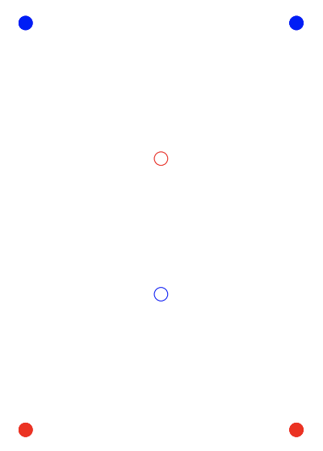

## 문제

Easter is coming and the Easter Bunny decided to organise a chocolate egg hunt for the children. He will hide two types of eggs: blue milk chocolate and red dark chocolate. In the field there are some redberry and some blueberry plants where the Easter Bunny could hide the eggs. Red eggs should be hidden in a redberry plant and blue eggs in a blueberry plant.

The local government has issued a permit for the event, under the condition that exactly N eggs are hidden. As they do not pay for the dental care plans of the local children, the Easter Bunny gets to decide himself how many eggs to hide of each colour.

According to the yearly tradition, there is a big reward for the first child to find both a red and a blue egg. In order to make the hunt as challenging as possible, the Easter Bunny wants to maximise the minimum distance between a red and a blue egg. To keep things fair, he will hide at most one egg in each plant. Your task is to write a program to help him accomplish his goal.

## 입력

The input consists of the following:

* one line containing three integers N, B, R, the number of eggs to hide N ≤ 250, the number of blueberry plants B < N and the number of redberry plants R < N;
* B lines, each containing two integers −104 ≤ x, y ≤ 104, indicating the coordinates (x, y) of a blueberry plant;
* R lines, each containing two integers −104 ≤ x, y ≤ 104 , indicating the coordinates (x, y) of a redberry plant.

The B + R plants are guaranteed to have distinct coordinates. Moreover, N is guaranteed to satisfy N ≤ B + R.

## 출력

Output a single line containing a floating point number, D, the largest minimum distance between a red and a blue egg that can be achieved. You are required to output D with absolute precision 10−6, i.e. with at least 6 decimal places.

## 힌트

Figure 3: Illustration of the second example input. The eggs are hidden in the four filled bushes.
