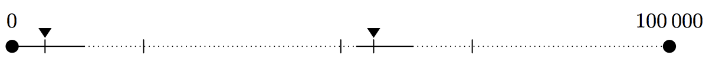

## 문제

Jonna often travels to programming contests by airplane. Since she lives in Helsinki, she often has to first travel to some large airport hub, such as Copenhagen Airport, where she takes a new flight. Unfortunately, flights are often very late. This is especially problematic when taking a connecting flight.

As it happens, Jonna just landed at Copenhagen Airport, trying to make her connection to Heathrow Airport. Since her flight from Helsinki was delayed, she must walk very quickly from her arrival gate to the new departure gate. Normally, Jonna walks at a speed of a centimeters per second. To make matters more difficult, Jonna has a slight coffee addiction, and will walk very sluggishly while not drinking coffee. While the coffee itself does not really affect the walking speed, the resulting grumpiness from not drinking coffee trumps even the worries of a missed flight. When she is drinking coffee, her speed increases to b centimeters per second.

The distance between Jonna’s arrival and departure gates is ℓ centimeters, and along the way there are n small coffee carts where Jonna can buy a cup of coffee. When buying a cup of coffee (a practically instant endeavour nowadays, thanks to contactless card payments), she first waits for t seconds, in order to let it cool down. During this time, she will keep walking at the slower pace. Immediately after t seconds pass, she starts drinking the coffee. It takes exactly r seconds to finish the coffee (during which she walks at the faster pace). When the coffee is finished, she will again walk slower.

Note that Jonna is carrying a bag with her left hand, so she can only carry a single cup of coffee at a time. While a bit wasteful, she may throw away a cup that still contains some amount of coffee to purchase a brand new cup.

Can you help Jonna determine where to purchase her coffee(s), in order to get to her departure gate as quickly as possible?

## 입력

The first line of input contains five integers ℓ, a, b, t and r, where:

* 1 ≤ ℓ ≤ 1011 is the distance between Jonna’s arrival and departure gates in centimeters.
* 1 ≤ a < b ≤ 200 are Jonna’s walking speeds in centimeters per second when she is not and when she is drinking coffee, respectively.
* 0 ≤ t ≤ 300 is the number of seconds Jonna must wait until she can drink her coffee.
* 1 ≤ r ≤ 1200 is the number of seconds it takes for Jonna to drink a cup of coffee.

Then follows a line containing an integer 0 ≤ n ≤ 500 000, the number of coffee carts between the two gates. The third and last line of input contains n integers – the positions of the coffee carts, given in ascending distance from the departure gate in centimeters (i.e., each number is between 0 and ℓ, inclusive). No two coffee carts are in the same postion.

## 출력

First, output a line containing the number of carts where Jonna should purchase coffee. Next, output a single line containing the indices of the coffee carts where Jonna should buy coffee. These indicies should be between 0 and n − 1, and correspond to the order of the coffee carts in the input. The indices may be output in any order, but each index must be output at most once.

Your answer will be accepted if the time that the proposed coffee purchasing plan takes is within an absolute or relative error of at most 10−9 compared to the optimum time.

## 힌트

Figure A.1: Illustration of Sample Input 1 and a possible solution. The coffee shops Jonna uses are marked with triangles. The portions where she walks faster due to the effects of coffee are marked with a dotted line. The first coffee cools down 11 000 centimeters from the starting position, and the second after 61 000 centimeters from the starting position.
