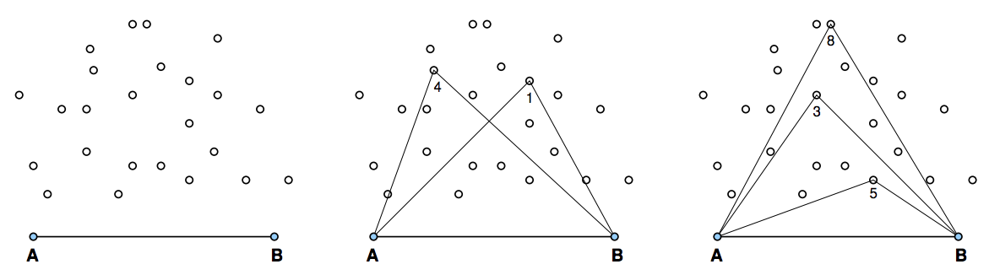

## 문제

São dadas duas âncoras, dois pontos A = (XA, 0) e B = (XB, 0), formando um segmento horizontal, tal que 0 < XA < XB, e um conjunto P de N pontos da forma (X, Y), tal que X > 0 e Y > 0. A figura mais à esquerda exemplifica uma possível entrada.

Para “ligar” um ponto v ∈ P precisamos desenhar os dois segmentos de reta (v, A) e (v, B). Queremos ligar vários pontos, mas de modo que os segmentos se interceptem apenas nas âncoras. Por exemplo, a figura do meio mostra dois pontos, 1 e 4, que não podem estar ligados ao mesmo tempo, pois haveria interseção dos segmentos fora das âncoras. A figura mais à direita mostra que é possível ligar pelo menos 3 pontos, 8, 5 e 3, com interseção apenas nas âncoras.

Seu programa deve computar o número máximo de pontos que é possível ligar com interseção de segmentos apenas nas âncoras.

## 입력

A primeira linha da entrada contém três inteiros, N (1 ≤ N ≤ 100), XA e XB (0 < XA < XB ≤ 104), representando, respectivamente, o número de pontos no conjunto P e as abscissas das âncoras A e B. As N linhas seguintes contêm, cada uma, dois inteiros Xi e Yi (0 < Xi, Yi ≤ 104), representando as coordenadas dos pontos, para 1 ≤ i ≤ N. Não há pontos coincidentes e não há dois pontos u e v distintos tais que {A, u, v} ou {B, u, v} sejam colineares.

## 출력

Seu programa deve imprimir uma linha contendo um inteiro, representando o número máximo de pontos de P que podem ser ligados com interseção de segmentos apenas nas âncoras.
