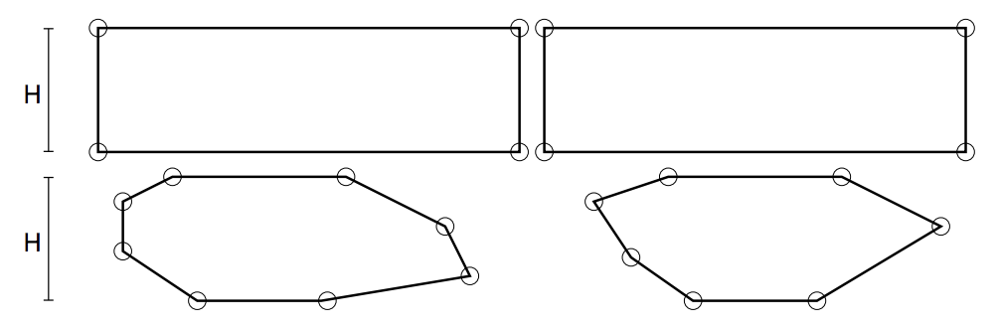
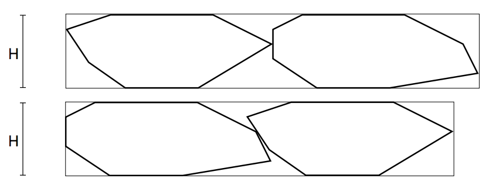

## 문제

A set of rectangular stone tiles, all of them having the same height H, had their original four corners cut in different ways so that two properties were kept:

1. Each tile is still a simple convex polygon.
2. Each tile has two parallel sides that are part of the bottom and top sides of the original rectangular tile, which implies that the height H was preserved.

The figure below illustrates two tiles before and after the cuts. The corners are highlighted with small circles.

We need to place all tiles, side by side and without overlap, along a frame of height H, for transportation. The tiles can be translated from their original positions, but they may not be rotated or reflected. Since their convex shapes may be very different, the order in which we place the tiles along the frame matters, because we want to minimize the width of the frame. The next figure shows the two possible orders for the tiles from the previous figure, the second order being clearly the one that minimizes the width of the frame.

Given the description of the set of tiles, your program must compute the minimum width for a frame of the same height of the tiles that contains all of them, side by side and without overlap.

## 입력

The first line contains an integer N (1 ≤ N ≤ 14) representing the number of tiles. Following, there are N groups of lines, each group describing a tile, all of them having the same height.

Within each group describing a tile, the first line contains an integer K (4 ≤ K ≤ 104) representing the number of corners of the tile. Each of the next K lines describes a corner of the tile with two integers X (−108 ≤ X ≤ 108) and Y (0 ≤ Y ≤ 108), indicating the coordinates of the corner in the XY plane. The corners are given in counterclockwise order. The first corner is (0, 0) and the second corner is of the form (X, 0) for X > 0, this side being the bottom side of the tile. The tile has the shape of a simple convex polygon with a top side parallel to its bottom side.

## 출력

Output a single line with a rational number indicating the minimum width for a frame of the same height of the tiles that contains all of them, side by side and without overlap. The result must be output as a rational number with exactly three digits after the decimal point, rounded if necessary
