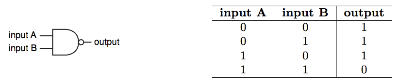
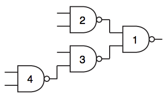

## 문제

A NAND gate (negative-AND gate) is a digital electronic circuit which produces an output that is false only if all its inputs are true; in other words, the output of a NAND gate is the complement to the output of an AND gate for the same inputs. A two-input NAND gate is a NAND gate with two inputs. The following figure shows the usual symbol of a two-input NAND gate and its truth table, using 1 for true and 0 for false.

In this problem we have a binary tree representing a circuit composed only by two-input NAND gates. In the tree, each internal node represents a NAND gate, which uses as inputs the values produced by its two children. Each leaf in the tree represents an external input to the circuit, and is a value in {0, 1}. The value produced by the circuit is the value produced by the gate at the root of the tree. The following picture shows a circuit with nine nodes, of which four are NAND gates and five are external inputs.

Each gate in the circuit may be stuck, meaning that it either only produce 0 or only produce 1, regardless of the gate’s inputs. A test pattern is an assignment of values to the external inputs so that the value produced by the circuit is incorrect, due to the stuck gates.

Given the description of a circuit, you must write a program to determine the number of different test patterns for that circuit.

## 입력

The first line contains an integer N (1 ≤ N ≤ 105) representing the number of gates in the circuit, which has the shape of a binary tree. Gates are identified by distinct integers from 1 to N, gate 1 being the root of the tree. For i = 1, 2, . . . , N, the i-th of the next N lines describes gate i with three integers X, Y and F (0 ≤ X, Y ≤ N and −1 ≤ F ≤ 1). The values X and Y indicate the two inputs to the gate. If X = 0 the first input is from an external input, otherwise the input is the output produced by gate X. Analogously, if Y = 0 the second input is from an external input, otherwise the input is the output produced by gate Y . The value F represents the state of the gate: −1 means the gate is well-behaved, 0 means the gate is stuck at 0, and 1 means the gate is stuck at 1.

## 출력

Output a single line with an integer indicating the number of different test patterns for the given circuit. Because this number can be very large, output the remainder of dividing it by 109 + 7.
