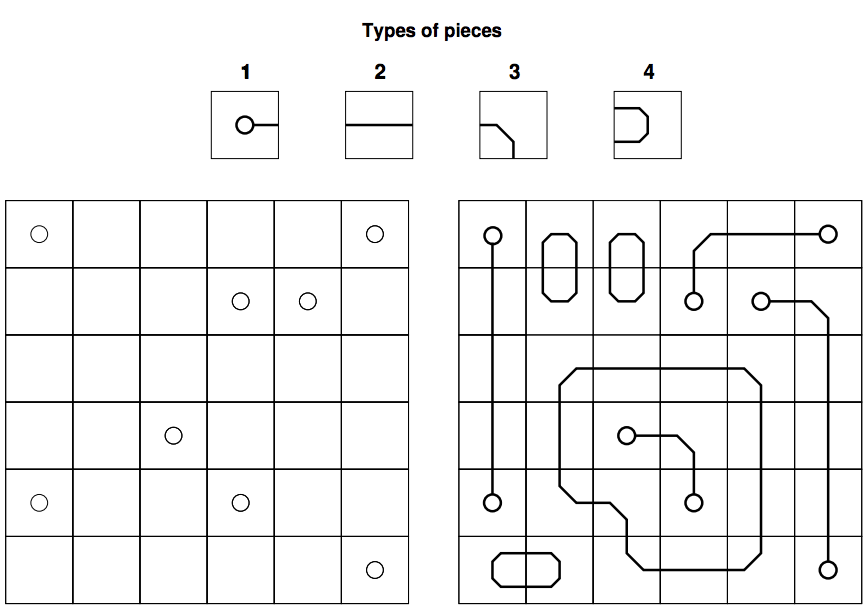

## 문제

Eve loves puzzles. She recently bought a new one that has proven to be quite difficult. The puzzle is made of a rectangular grid with R rows and C columns. Some cells may be marked with a dot, while the other cells are empty. Four types of pieces come with the puzzle, and there are R × C units of each type.

The objective of the puzzle is to use some of the pieces to completely fill the grid; that is, each cell must be covered with a piece. In doing that, each piece may be rotated 90, 180 or 270 degrees. But of course, to make it more interesting, there are a few constraints that must be respected:

1. Type 1 pieces can only be used on cells marked with a dot, while the other types of pieces can only be used on empty cells.
2. Given any pair of cells sharing an edge, the line drawings of the two pieces on them must match.
3. The line drawings of the pieces cannot touch the border of the grid.

As Eve is having a hard time to solve the puzzle, she started thinking that it was sloppily built and perhaps no solution exists. Can you tell her whether the puzzle can be solved?

## 입력

The first line contains two integers R and C (1 ≤ R, C ≤ 20), indicating respectively the number of rows and columns on the puzzle. The following R lines contain a string of C characters each, representing the puzzle’s grid; in these strings, a lowercase letter “o” indicates a cell marked with a dot, while a “-” (hyphen) denotes an empty cell. There are at most 15 cells marked with a dot.

## 출력

Output a single line with the uppercase letter “Y” if it’s possible to solve the puzzle as described in the statement, and the uppercase letter “N” otherwise.
