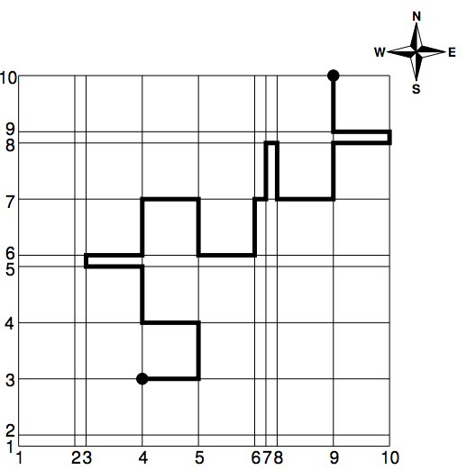

## 문제

The city of Linearville has N parallel two-way streets going in the West-East direction and N parallel two-way streets going in the South-North direction, making up a grid with (N − 1) × (N − 1) blocks. The distance between two consecutive parallel streets is either 1 or 5. The Linearville Transit Authority is conducting an experiment and now requires all cars to always follow a path that alternates direction between W-E and S-N at every crossing, meaning they must turn either left or right when reaching a crossing. The LTA is developing a new navigation app and needs your help to write a program to compute the lengths of shortest alternating paths between many pairs of start and target crossings. The alternating path in the figure, as an example for N = 10, is clearly not a shortest alternating path. But beware! Linearville may be huge.

## 입력

The first line contains an integer N (2 ≤ N ≤ 105) representing the number of streets in each direction. For each direction, the streets are identified by distinct integers from 1 to N starting at the S-W corner of the city. The second line contains N − 1 integers D1, D2, . . . , DN−1 (Di ∈ {1, 5} for i = 1, 2, . . . , N − 1) indicating the distances between consecutive streets going S-N (that is, Di is the distance between street i and street i + 1). The third line contains N − 1 integers E1, E2, . . . , EN−1 (Ei ∈ {1, 5} for i = 1, 2, . . . , N − 1) indicating the distances between consecutive streets going W-E (that is, Ei is the distance between street i and street i + 1). The fourth line contains an integer Q (1 ≤ Q ≤ 105) representing the number of shortest path queries. Each of the next Q lines describes a query with four integers AX, AY , BX and BY (1 ≤ AX, AY, BX, BY ≤ N), indicating that the start crossing is (AX, AY) and the target crossing is (BX, BY); the values AX and BX are streets going S-N while the values AY and BY are streets going W-E. There are no repeated queries.

## 출력

Output Q lines, each line with an integer indicating the length of a shortest alternating path for the corresponding query of the input.
