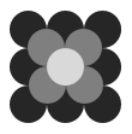

## 문제

You may have seen a champagne tower at a wedding or an exclusive Hollywood A-list party. In a typical three-level tower, the first (lowest) level contains 9 glasses touching in a square pattern. The second level contains 4 glasses touching in a square pattern centered above the first level, and the third level contains 1 glass centered above the other levels. Figure A.1 shows a a top-down view of this tower.

Figure A.1

Champagne is always poured directly into the top glass. In this example, once the top glass fills and starts to overflow, it immediately begins filling the 4 glasses below (i.e., assume overflowing champagne travels instantaneously to any glasses below). Once the 4 glasses on the second level fill, they begin overflowing to the 9 on the bottom level. Note that in this example the 4 on the second level finish filling at the same time, but the 9 on the lowest level finish filling at different times. This means that there will be some amount of spilled champagne before the tower has finished filling – this is an acceptable price to pay for such a beautiful sight.

The new fad is to make interesting patterns or imagery out of champagne glasses. These new-fangled “towers" needn’t appear structurally sound; they can be held in place with complex support systems designed so as not to interfere with the overflowing champagne. Each of these new towers will always have a single highest glass into which all champagne is directly poured.

If two glass rims coincide vertically (i.e., have the same center and radius), then no accumulation occurs into the lower glass from the upper glass (though the overflow champagne from the upper glass may still be collected by other lower glasses). Additionally, a single point of champagne overflow causes no measurable accumulation. In other words, measurable accumulation only occurs when a non-point arc of champagne overflows to the interior of a glass.

Your task is to determine whether a proposed champagne tower will fill to completion, and if so, how long it will take.

## 입력

The input begins with a single integer n representing the number of champagne glasses in the tower (1 ≤ n ≤ 20). The next n lines each describe a champagne glass. Each glass description consists of 5 values x y z r v with (x, y, z) representing the center of the glass’s rim (0 ≤ x, y ≤ 1000; 1 ≤ z ≤ 1000), r representing its radius (1 ≤ r ≤ 1000), and v representing its volume measured in milliliters (1 ≤ v ≤ 1000). All input values are integers, and the top glass is filled at a constant 100 milliliters per second.

## 출력

Display the number of seconds after which the tower will be completely filled, or Invalid if the proposed champagne tower will never fill completely. Round answers to the hundredths place. Always print answers to two decimal places and include the leading 0 on answers between 0 and 1. Output values will always be ≤ 106 seconds (or 11 days, 13 hours, 46 minutes and 40 seconds, whichever you prefer).
