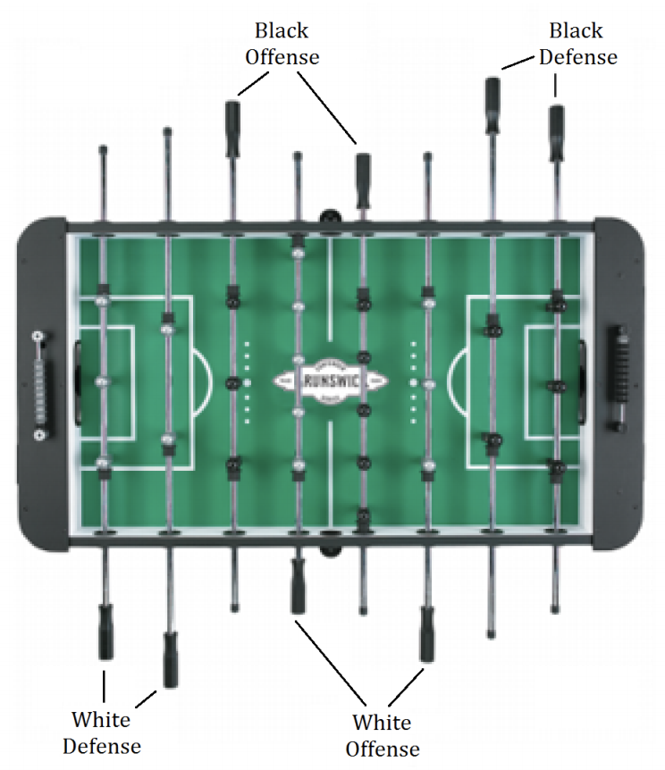

## 문제

Balaji and his coworkers like to play Foosball on their lunch break. Foosball is a game typically played by 2 players (individual matchup) or 4 players (team play). However, due to the increasing interest and availability of coworkers, Balaji has created a new variation that supports 5 or more players. Each individual point is played by four players: two on the White team and two on the Black team.

Figure B.1

The remaining players wait in line for their turn to play. On each point, the players on the scoring team switch positions (e.g., if White scores the point, then the White Offense player becomes the White Defense player, and vice versa). The Offense player of the team that lost the point becomes the Defense player of the same team, while the Defense player of the team that lost the point goes to the back of the line and waits for their next chance to play. The person at the front of the line becomes the new Offense player of the team that lost the point.

Based on these rules, a team that continues scoring consecutive points gets to keep playing together (swapping positions with each other after each point) until the other team breaks the streak. Each such streak of points creates a dynasty for the winning team. Dynasties can be short-lived (a single point) or long-lived, but they are always broken when the opposing team scores a point. The “winners" of this variation of foosball are the players that can create the longest dynasty.

## 입력

Input begins with a line containing an integer n representing the number of players (5 ≤ n ≤ 10). The next line contains the n names of all participating players. The first four are the names of the four players who initially arrive at the table (in that order): the first person to arrive starts at White Offense, the second starts at Black Offense, the third starts at White Defense, and the fourth starts at Black Defense. The remaining players get in line to wait for their turn. The final input line contains a non-empty string indicating which side scored each point, with a White team point represented by ‘W’ and a Black team point represented by ‘B’. The maximum length of this string will be 1000.

## 출력

Display the team that has achieved the longest dynasty. If more than one team ties for the record, then display each of these teams in chronological order, one team per line. When displaying a team, names should be displayed in the order in which the players arrived at the table for that team. Note that it is possible for the same team to appear more than once in the output, potentially with the player names in a different order
