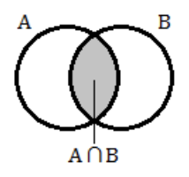

## 문제

Venn diagrams were invented by the great logician John Venn as a way of categorizing elements belonging to different sets. Given two sets A and B, two overlapping circles are drawn – a circle representing the elements of A, and another representing the elements of B. The overlapping region of the circles represents element that belong to both A and B, i.e., the intersection of the two sets A ∩ B. A classic Venn diagram might look like this:

Figure H.1

One of John’s biggest fans was his grandson, Vin Vaughn Venn. Vin was inspired by his grandfather’s diagrams, but Vin was a very creative individual. Simple overlapping circles struck Vin as too boring of a way to visualize the sometimes messy intersections of categories, so he set out to make his grandfather’s diagrams more interesting. Just like Venn diagrams, Vin diagrams are used as a way of categorizing elements belonging to different sets A and B, but the representation of each set is not required to be a circle. In fact, each set can have any shape as long as there is single overlapping section for elements in the intersection of A and B.

In this problem, Vin diagrams will be laid out on a grid. Each set representation is a loop of ‘X’ characters, with one ‘X’ in each loop replaced by an ‘A’ or ‘B’ to identify the loop. All empty positions (both inside and outside of the loops) are represented by period (‘.’) characters, and the set of positions inside a loop is contiguous. Each loop character touches exactly two other loop characters either vertically or horizontally. Loops do not self-intersect, and other than the allowed horizontal/vertical paths and right angle connections, different parts of the loop do not touch (see Figures H.2 and H.3 below).

|  |  |
| --- | --- |
|  |  |
| Figure H.2: Two legal loops | Figure H.3: Two illegal loops |

Loops A and B intersect at exactly two points. Loop intersection points always follow the pattern shown in Figure H.4 (including the four ‘.’ positions around the intersection). No loop makes a right angle turn at an intersection point but always flows straight through the intersection, either vertically or horizontally. An example of legally intersecting loops is shown in Figure H.5.

|  |  |
| --- | --- |
|  |  |
| Figure H.4: Intersection point and surrounding positions | Figure H.5: Legally intersecting loops |

## 입력

The input starts with two integers r c describing the number of rows and columns in the Vin diagram (7 ≤ r, c ≤ 100). The following r rows each contain a string of c characters. All positions that are not part of loop A or loop B are marked with a period (‘.’) character. The loop labels ‘A’ and ‘B’ are placed somewhere around the loops’ perimeters at non-intersection positions and are never on the same loop.

## 출력

Display, in order, the area of the Vin diagram exclusive to set A, the area exclusive to set B, and the area of the intersection. Given the representation of Vin diagrams, the area of a section is defined as the number of periods (‘.’) it encloses.
