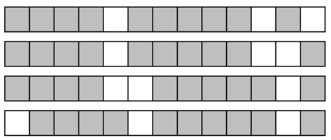
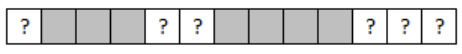

## 문제

Nonograms (also known as Paint by Numbers or Hanjie) is a logic puzzle which encodes a blackand-white picture using sequences of numbers. The object of the puzzle is to recreate the picture from the numbers. The puzzle initially consists of a blank n × m grid, with a sequence of numbers associated with each row and each column. These numbers indicate the lengths of runs of black squares in a row (from left to right) or column (from top to bottom). For example, if the numbers for a row are 4 5 1 it indicates that somewhere in the row there is a run of 4 consecutive black squares followed later by a run of 5 consecutive black squares which is in turn followed by a run of a single black square. There must be 1 or more white spaces between each black run, and there can be 0 or more white squares before the first or after the last black run. In our example, if the length of a row is 13, then there are four possible layouts of black and white squares:

Figure J.1

Note that in all four of the possible layouts certain squares are always black, as shown in Figure J.2, while others can be either white or black (indicated by ‘?’)

Figure J.2

In fact, this is a major technique in solving Nonograms, since they not only help in filling black squares in a particular row (as above), but the black squares then constrain the possible layouts in the intersecting columns. This helps in filling in black squares in the columns, which in turn lead to more constraints on black squares in the rows, and so on. Similarly, we may sometimes deduce that certain tiles must be white, based solely on the sequence of runs for a given row or column and the colors of tiles in that row or column that were determined previously. For many puzzle instances, applying this approach repeatedly suffices to find a solution. In more complicated Nonograms, other methods need to be used as well, but for the purposes of this problem we will not only ignore these methods but insist that you use no technique other than the one described above.

## 입력

Input starts with a line containing two integers n m, where n is the number of rows in the grid and m is the number of columns (1 ≤ n, m ≤ 100). Following this are n lines each giving the sequence of numbers for a row, starting with the uppermost row. Each of these lines has the form p v1 v2 ... vp, where p is the number of values in the sequence, and v1 ... vp is the sequence. After these n lines are m lines which describe the columns in a similar way, starting with the leftmost column. The Nonogram puzzle is guaranteed to have at least one arrangement of black and white squares consistent with all the sequences, which may or may not be fully discoverable with the technique described above.

## 출력

Display the most complete picture that can be constructed using only the technique described above. Your output should consist of n lines containing m characters each. Use an ‘X’ for a black square, a ‘.’ for a white square, and a ‘?’ for a square that cannot be determined.
