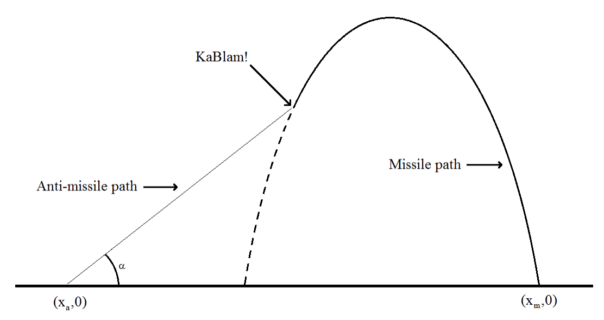

## 문제

You’ve been asked to write software to help launch anti-missile rockets in order to take out missiles shot by the enemy. You’ve decided to use a simple 2-dimensional model, with the launch site of the missile located on the x axis at (xm, 0) and your anti-missile launch site at (xa, 0) (all values in feet). You also know the initial x and y velocities of the missile at the moment of launch: vx and vy (in feet per second). Given this information, you know that if the missile is launched at time 0 then the location of the missile at any later time t is given by

(xm + vxt, vyt − 16t2)

The image below shows one possible trajectory for the missile and the anti-missile. Note that the missile’s trajectory is a parabola while the anti-missile’s trajectory is a straight line. Also note in this scenario that vx is negative (vy will always be positive).

Your higher-ups want to be able to destroy the missile at a specific time tK. Your job is to decide when to shoot your anti-missle and at what angle α so that you intercept the enemy’s missile at that time. To aid in your calculations you also know the velocity of your anti-missile along its trajectory, va. Note that it might be impossible to destroy the missile at time tK, either because you would have had to shoot your anti-missile before the enemy’s missile is launched, or because the missile would have already landed (and blown up) prior to or at time tK. If that’s the case, your software should sound an alarm so that everyone can start running.

## 입력

Input consists of a single line containing six integers: xm vx vy xa va tK, where 0 < vy, va, tK ≤ 10000, −10000 ≤ xm, vx, xa ≤ 10000 and xm ≠ xa.

## 출력

If it is impossible to destroy the missile at the requested time, display the phrase start running. Otherwise, display two values tL α, where tL is the time to launch your anti-missile and α is the launch angle (in degrees). Both values should have a maximum relative or absolute error of 10−4.
