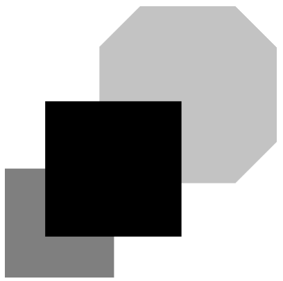

## 문제

Arty has been an abstract artist since childhood, and his works have taken on many forms. His latest (and most pricey) creations are lovingly referred to as Abstract Art within the abstract art community (they’re not the most original bunch when it comes to loving nicknames). Here’s an example of one of Arty’s recent works:

Figure A.1: An example of Arty’s art.

As you can see, Abstract Art is created by painting (possibly overlapping) polygons. When Arty paints one of his designs he always paints each polygon completely before moving on to the next one.

The price of individual pieces of Arty’s Abstract Art varies greatly based on their aesthetic appeal, but collectors demand two pieces of information about each painting:

1. the total amount of paint used, and
2. the total amount of canvas covered.

Note that the first value will be larger than the second whenever there is overlap between two or more polygons. Both of these values can be calculated from a list containing the vertices of all the polygons used in the painting, but Arty can’t waste his time on such plebeian pursuits — he has great art to produce! I guess it’s left up to you.

## 입력

The first line of input contains a single integer n (1 ≤ n ≤ 100) representing the number of polygons to be painted. Following this are n lines each describing a painted polygon. Each polygon description starts with an integer m (3 ≤ m ≤ 20) indicating the number of sides in the polygon, followed by m pairs of integers x y (0 ≤ x, y ≤ 1 000) specifying the coordinates of the vertices of the polygon in consecutive order. Polygons may be concave but no polygon will cross itself. No point on the canvas will be touched by more than two polygon border segments.

## 출력

Display both the total amount of paint used and the amount of canvas covered. Your answers must have a relative or absolute error of at most 10−6.
