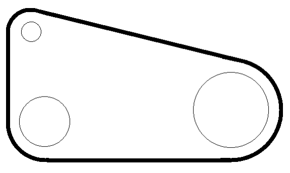

## 문제

General Warren Pierce has a bit of a problem. He’s in charge of a new type of drone-delivered explosive and they’ve been testing it out in the Nevada desert, far enough from any population center to avoid civilian casualties and prying eyes. Unfortunately word has gotten out about these experiments and now there’s the possibility of careless on-lookers, nefarious spies, or even worse — nosy reporters! To keep them away from the testing area, Warren wants to erect a single fence surrounding all of the circular craters produced by the explosions. However, due to various funding cuts (to support tax cuts for the you-know-who) he can’t just put up miles and miles of fencing like in the good old days. He figures that if he can keep people at least 10 yards away from any crater he’ll be okay, but he’s unsure of how much fencing to request. Given the locations and sizes of the craters, can you help the General determine the minimum amount of fencing he needs? An example with three craters (specified in Sample Input 1) is shown below.

Figure B.1: Three craters with a fence around them.

## 입력

The first line of input contains a single positive integer n (n ≤ 200), the number of craters. After this are n lines specifying the location and radius of each crater. Each of these lines contains 3 integers x y r, where x and y specify the location of a crater (|x, y| ≤ 10 000) and r is its radius (0 < r ≤ 5 000). All units are in yards.

## 출력

Display the minimum amount of fencing (in yards) needed to cordon off the craters, with an absolute or relative error of at most 10−6.
