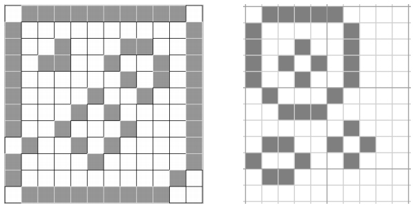

## 문제

After a successful Kickstarter campaign, Sheba Arriba has raised enough money for her mail-order biology supply company. “Sheba’s Amoebas” can ship Petri dishes already populated with a colony of those tiny one-celled organisms. However, Sheba needs to be able to verify the number of amoebas her company sends out. For each dish she has a black-and-white image that has been pre-processed to show each amoeba as a simple closed loop of black pixels. (A loop is a minimal set of black pixels in which each pixel is adjacent to exactly two other pixels in the set; adjacent means sharing an edge or corner of a pixel.) All black pixels in the image belong to some loop.

Sheba would like you to write a program that counts the closed loops in a rectangular array of black and white pixels. No two closed loops in the image touch or overlap. One particularly nasty species of cannibalistic amoeba is known to surround and engulf its neighbors; consequently there may be amoebas within amoebas. For instance, each of the images in Figure H.1 contains four amoebas.

Figure H.1: Two Petri dishes, each with four amoebas.

## 입력

The first line of input contains two integers m and n, (1 ≤ m, n ≤ 100). This is followed by m lines, each containing n characters. A ‘#’ denotes a black pixel, a ‘.’ denotes a white pixel. For every black pixel, exactly two of its eight neighbors are also black.

## 출력

Display a single integer representing the number of loops in the input.
