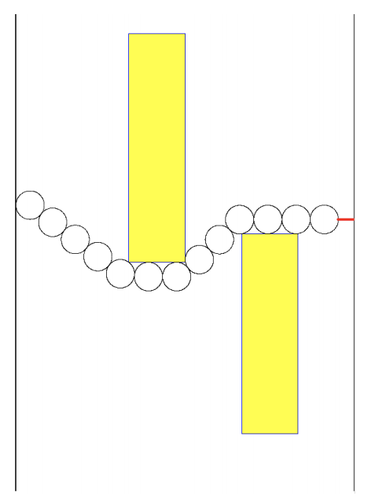

## 문제

Figure C.1: A strand of disks along a wall

Suppose you want to decorate a party room wall with a string of rings, each having 1-foot diameter and each touching the next ring at precisely one point. You cannot necessarily string the rings in a straight line because there are rectangular pictures on the wall that you must avoid. From a given starting point against the left end of the wall you want to use as few rings as possible so that the last ring is less than one foot from the right end of the wall. Using the minimum number of rings, you also wish to minimize the distance between the final ring and the right wall.

Figure C.1 shows such an optimal solution, with the minimum number of rings and with the distance to the right wall (shown as a red segment) minimal among those solutions with the fewest rings.

The pictures on the wall will have some characteristics upon which you may depend:

* Each picture is at least two feet wide.
* Each picture is at least two feet away from the left wall, the right wall, the floor, and the ceiling.
* For each picture, the floor-to-ceiling region that spans from two feet to the left of the picture to two feet to the right of the picture is unobstructed by other pictures.

## 입력

All distances are measured in feet. The first line of input contains three integers, N, S, and W, where 1 ≤ N ≤ 6 is the number of pictures on the wall, 1 ≤ S ≤ 99 is the starting ring’s center height above the floor, and 1 ≤ W ≤ 99 is the width between the left and right walls. The center of the starting disk will be 0.5 feet from the left wall.

The second line contains picture position information for the N pictures in order from the left side of the room to the right. Each picture is given by four integer distances in feet, L R B T. Here L and R are the distances from the left end of the wall to the left and right edges of the picture, and B and T are the distances from the floor to the bottom and top edges of the picture. For each picture L + 2 ≤ R and 2 ≤ B < T. For the leftmost picture, 2 ≤ L. For the rightmost picture, R ≤ W − 2. The R distance for one picture is always at least 2 less than the L distance for the next picture to the right.

Assume the ceiling of the room is at least two feet higher than the center of the initial ring and the tops of all the pictures, so it is out of the way, and its exact height is not relevant.

## 출력

Output is a single floating-point number: M +d, where M is the minimal number of rings in a string ending with rightmost point less than 1 foot from the right wall, and d is the minimal distance from the right wall to the rightmost point on the Mth ring. The number that you output should be accurate to within an absolute or relative error of 10−3.

Note that the form of the output is such that there is no special roundoff issue if you have a ring’s right point at a distance very close to 1 foot from the right wall: With a distance 1 or over, there is room for 1 more ring, and the remaining distance to the wall goes down by 1 to compensate.
