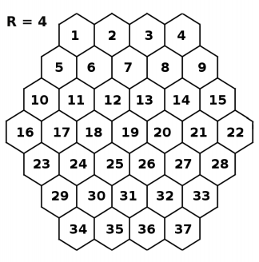
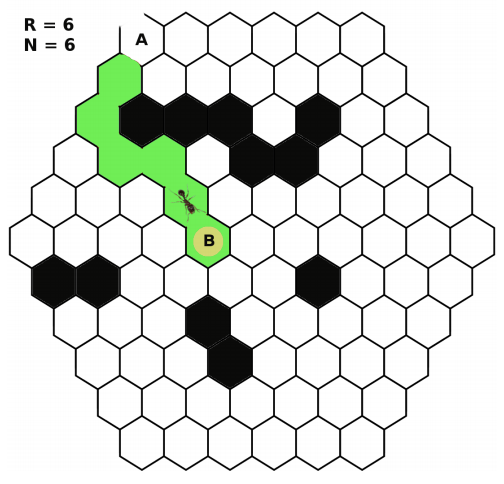
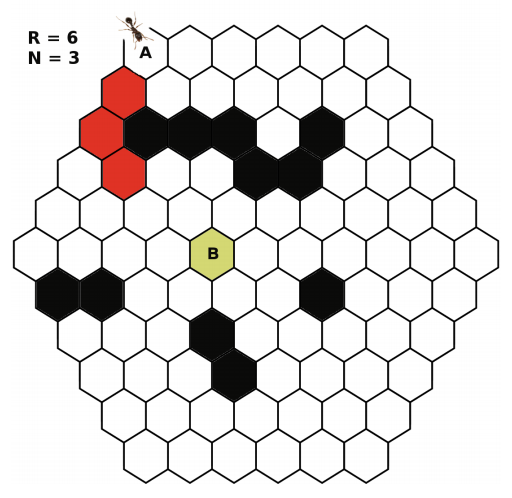

## 문제

0x67 is a scout ant searching for food and discovers a beehive nearby. As it approaches the honeycomb, 0x67 can sense an area inside packed with dried honey that can be easily carried back to the nest and stored for winter. However, it must burrow through the honeycomb to reach the cell containing the sweet loot. If 0x67 can create a passage to the honey to help the other ants find it, it will do so before returning to the nest.

The cells of the honeycomb are numbered in row major order, so cell IDs can be assigned as shown below:

When 0x67 discovers the opening to the honeycomb, it enters the cell. Some ants are stronger than others, depending on their age, so 0x67 can only chew through at most N cells before its jaw wears out and must return to the nest to recuperate. The honeycomb is hexagonal, and each edge length is R cells. 0x67 enters through a hole at location A and must get to the honey at location B by chewing a path through no more than N adjacent cells. Because ants can be competitive, 0x67 wants to reach the honey by chewing through the fewest possible cells. 0x67 can also sense some of the cells are hardened with wax and impossible to penetrate, so it will have to chew around those to reach the cell at location B.

Scout ants have rudimentary computational skills, and before 0x67 begins to chew, it will work out where it needs to go, and compute K, the least number of cells it needs to chew through to get from A to B, where B is the Kth cell. If K > N, 0x67 will not be strong enough to make the tunnel. When 0x67 returns to the nest, it will communicate to its nestmates how many cells it chewed through to get to B, or will report that it could not get to the honey.

## 입력

The input contains two lines. The first line contains five blank separated integers: R N A B X

* R: the length (number of cells) of each edge of the grid, where 2 ≤ R ≤ 20. The total number of cells in the grid can be determined by taking a difference of cubes, R3 − (R − 1)3.
* N: the maximum number of cells 0x67 can chew through, where 1 ≤ N < R3 − (R − 1)3.
* A: the starting cell ID, This cell is located on one of the grid edges: The cell has fewer than six neighbors.
* B: the cell ID of the cell containing the honey, where 1 ≤ B ≤ R3 − (R − 1)3.
* X: the number of wax-hardened cells, where 0 ≤ X < (R3 − (R − 1)3 ) − 1.

The second line contains X integers separated by spaces, where each integer is the ID of a wax-hardened cell.

The ID’s, A, B, and all the ID’s on the second line, are distinct positive integers less than or equal to R3 − (R − 1)3.

## 출력

A single integer K if 0x67 reached the honey at cell B, where B is the Kth cell, otherwise the string No if it was impossible to reach the honey by chewing through N cells or less.

## 힌트

Figure E.1: K=6

Figure E.2: No
