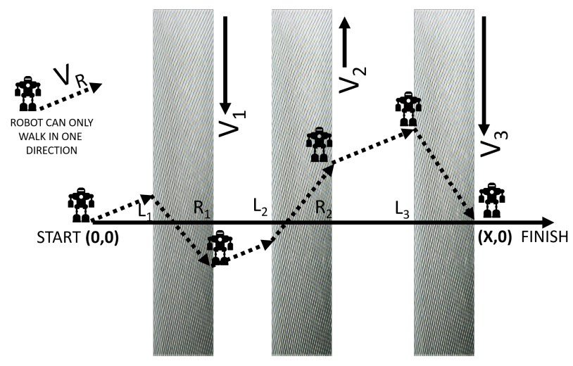

## 문제

You have a toy robot that walks straight at a constant speed v, and you wish for it to travel on the two-dimensional plane from (0, 0) to (X, 0). If the plane were empty, you could start the robot facing straight east from the origin, and it would walk there in X/v time. Unfortunately, between the start and the destination are n moving sidewalks, each moving directly north or south, which affect the robot’s position while it is walking.

The direction that robot is facing is not changed by the sidewalks; the robot will face in the same orientation for the entire duration of its walk. These sidewalks are aligned with the y-axis and are infinitely long. You still must get the robot to go from start to finish, but you’ll need to adjust the orientation of the robot at the start. Given that you choose this direction correctly, so that the robot arrives exactly at the destination, how long will it take the robot to get there?

One final caveat: You don’t want the toy robot to walk for too long. If the robot cannot reach the destination in at most twice the time it would take in the absence of all moving sidewalks (i.e., 2X/v), indicate this.

## 입력

The first line consists of three space-separated numbers n, X, and v (0 ≤ n ≤ 100; 1 ≤ X ≤ 1,000,000; 1.0 ≤ v ≤ 100.0). Note that v is not necessarily an integer.

Each of the next n lines contains three space-separated numbers li, ri, and vi (0 ≤ l1 < r1 ≤ l2 < r2 ≤ · · · ≤ ln < rn ≤ X; −100.0 ≤ vi ≤ 100.0), describing the ith moving sidewalk. The integer li denotes the left edge of the sidewalk, the integer ri denotes the right edge of the sidewalk, and the decimal number vi denotes the speed of the sidewalk. A positive speed means the sidewalk moves north, while a negative speed means the sidewalk moves south.

## 출력

If the robot cannot reach the destination in at most twice the time it would take in the absence of all moving sidewalks, output “Too hard” on a single line (without quotation marks).

Otherwise, output, on a single line, the travel time of the robot from the start to the destination, rounded and displayed to exactly three decimal places.
