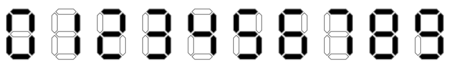

## 문제

Anna has just finished her course project. She has a lot of seven-segment LED displays as leftovers and a small power source. Each display consumes power proportionally to the number of lit segments, e.g. ‘9’ consumes twice more power than ‘7’.

Anna wonders what is the maximum possible sum of digits she is able to achieve, if her power source is able to light n segments, and she wants to light exactly n segments.

## 입력

The single line of the input contains one integer n — the number of segments that should be lit (2 ≤ n ≤ 106).

## 출력

Output a single integer — the maximum possible sum of digits that can be displayed simultaneously.

## 힌트

In the first example, a single ‘4’ should be displayed (‘7’ has greater value, but has only three segments). In the second example ‘4’ and ‘7’ should be displayed, in the third one — two ‘7’s.
