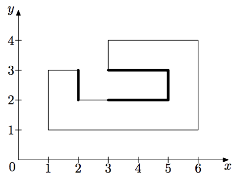

## 문제

There are only two directions in Perpendicularia: vertical and horizontal. Perpendicularia government are going to build a new secret service facility. They have some proposed facility plans and want to calculate total secured perimeter for each of them.

The total secured perimeter is calculated as the total length of the facility walls invisible for the perpendicularly-looking outside observer. The figure below shows one of the proposed plans and corresponding secured perimeter.

Write a program that calculates the total secured perimeter for the given plan of the secret service facility.

## 입력

The plan of the secret service facility is specified as a polygon.

The first line of the input contains one integer n — the number of vertices of the polygon (4 ≤ n ≤ 1000). Each of the following n lines contains two integers xi and yi – the coordinates of the i-th vertex (−106 ≤ xi, yi ≤ 106). Vertices are listed in the consecutive order.

All polygon vertices are distinct and none of them lie at the polygon’s edge. All polygon edges are either vertical (xi = xi+1 or horizontal (yi = yi+1) and none of them intersect each other.

## 출력

Output a single integer — the total secured perimeter of the secret service facility.
