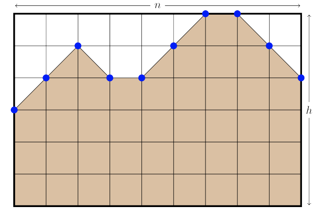

## 문제

Andrew is building a 2D golf course called the Front Nine where each hole will be exactly n units long. In order to generate many (hopefully) unique holes, he will do it with a randomised algorithm. A single hole is defined by a function y : [0, n] → [0, h] which for each x-coordinate in the range [0, n] gives the height of the hole’s terrain (between 0 and h) at that point.

Andrew’s randomised algorithm for generating a single hole is as follows:

**Step 1** Set y(0) = a.

**Step 2** For each i = 1, 2, . . . , n, let

y(i) = fix(y(i − 1) + r(i))

where r(i) is a random integer chosen from the set {−1, 0, 1} with probabilities P−1, P0 and P1 percent, respectively (P−1 + P0 + P1 = 100). And fix is a function defined by

fix(y) = 0 (if y < 0), y (if 0 ≤ y ≤ h), h (if h < y)

which clamps (restricts) its output to the range [0, h].

**Step 3** Once we have y(i) for each i = 0, 1, ..., n we fill in each interval (i, i + 1) of the function with the straight line that joins the points (i, y(i)) and (i + 1, y(i + 1)).

**Step 4** All of the area under y is filled in with dirt.

Figure F.1: An example with n = 9, h = 6, a = 3. The area of dirt is 42.5. One possible function r: r(1) = 1, r(2) = 1, r(3) = −1, r(4) = 0, r(5) = 1, r(6) = 1, r(7) = 1, r(8) = −1, r(9) = −1.

Since Andrew wants to build many holes, he needs to know how much dirt he will need. Help him by determining the expected area under the terrain for each hole.

## 입력

The input consists of a single line containing six integers n (1 ≤ n ≤ 100 000), which is the length of the hole, h (0 ≤ h ≤ 100), which is the maximum height of the hole, a (0 ≤ a ≤ h), which is the height at x = 0, P−1 (0 ≤ P−1 ≤ 100), P0 (0 ≤ P0 ≤ 100) and P1 (0 ≤ P1 ≤ 100), which are the probability of r being −1, 0 and 1, respectively. In addition, P−1 + P0 + P1 = 100.

## 출력

Display the expected area under the terrain. Your answer should have an absolute or relative error of less than 10−6.
