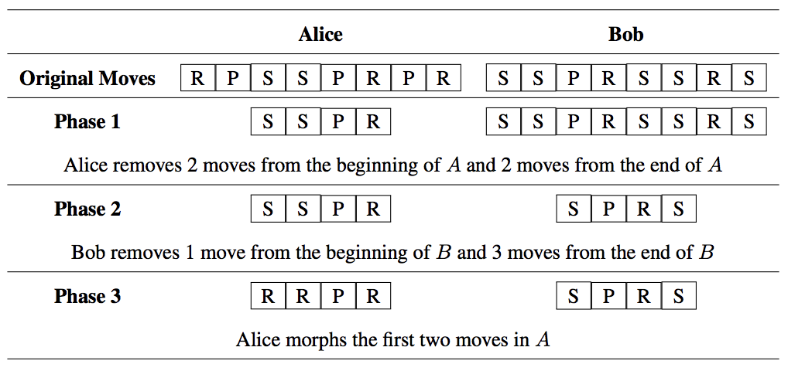

## 문제

Next week is the Rock-Paper-Scissors World Championships between the top 2 contestants in the world: Alice and Bob! But this is not your typical RockPaper-Scissors tournament—this is Jupiter Rock-Paper-Scissors. The basics of the game are still the same: rock-beats-scissors, scissors-beats-paper, paperbeats-rock, but the luck of the game has been removed. Prior to the contest, each player selects a string of n moves, where each move is either R, P or S. We will call Alice’s move string A and Bob’s move string B.

The game is played in three setup phases, then one play phase. The phases happen in order: first Phase 1, then Phase 2, then Phase 3, followed by the Play Phase.

In Phase 1, Alice removes some moves from the beginning of A (possibly none) and some moves from the end of A (possibly none) so that she is left with exactly k moves. In Phase 2, Bob removes some moves from the beginning of B (possibly none) and some moves from the end of B (possibly none) so that he is left with exactly k moves.

In Phase 3, Alice selects ℓ consecutive moves from A and morphs them. Morphing a move means changing every rock-to-paper, paper-to-scissors and scissors-to-rock.

In the Play Phase, the players now play their k moves from left-to-right (using normal Rock-Paper-Scissors rules). The player that reaches m wins first is awarded two points. If neither player reaches m wins, then both players are awarded one point. Each player’s goal is to maximise their point total.

For example, say that n = 8, k = 4, ℓ = 2 and m = 1. Here is one possible play-through of this game.

Then the Play Phase occurs. The first move is a win for Alice (rock-beats-scissors) and since m = 1, only one win is needed, so Alice is awarded two points and the game stops. Note that once Alice made her decision in Phase 1, there is no way for Bob to get two points (or even one point) since no matter what Bob decides to do in Phase 2, Alice always has a way to get the two points.

In all phases, both players have full knowledge of the other player’s move string and all decisions made in previous phases. Assuming both players play optimally, who wins?

## 입력

The first line of input contains four integers n (1 ≤ n ≤ 50), which is the number of moves, k (1 ≤ k ≤ n), which is the value for Phase 1 and Phase 2, ℓ (0 ≤ ℓ ≤ k), which is the value for Phase 3, and m (1 ≤ m ≤ k), which is the number of moves that a player must win in order to get two points.

The second line contains the string A, which is Alice’s move string. The third line contains the string B, which is Bob’s move string. Both move strings will have length n and consist of only R, P and S.

## 출력

Display the name of the winner that receives the most points assuming both players play optimally. If both players receive the same number of points, display Draw instead.
