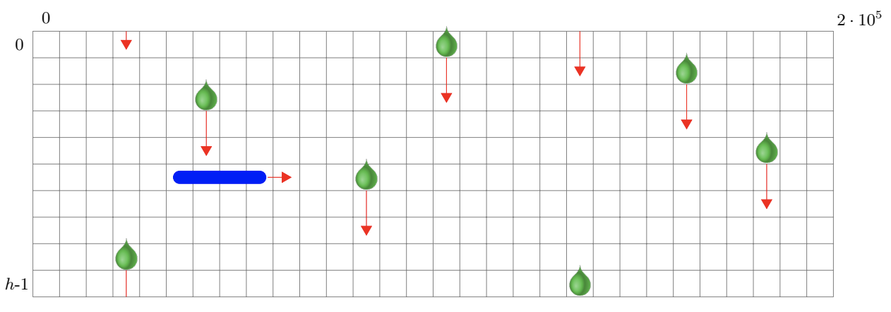

## 문제

You are playing a computer game in which you need to throw discs horizontally from the left side of the screen to the right. However, acid is constantly dripping vertically from multiple points in the ceiling to the ground, and any contact with the deadly acid will instantly destroy your disc. After several fails, you wonder whether it is possible to make it through to the other side.

There are n dripping spots located on row 0. Any drop that originates from dripping spot k falls v pixels every time your disc moves one pixel to the right. When a drop hits the ground, a new drop starts to fall from the dripping spot in the same column so that there is always exactly one acid drop per column. The drop present in the column of dripping spot k at time t has a vertical position of

(yk + t · v) mod h,

where yk is the vertical position of the k th drop at time 0 and h is the height of the ceiling.

Animation of your disc and the acid drops alternate. That is, first your disc moves one pixel horizontally to the right, then all acid drops move v pixels vertically downwards, visiting each pixel on the way. Your disc is only a single pixel thick and w pixels wide, while acid drops occupy a single pixel. The disc is destroyed if it ever occupies the same pixel as an acid drop. The throwing height can be any height between 0 and h − 1, inclusive, and the disc will stay at the same height throughout its journey. At time 0, the disc is occupying columns −w through −1, inclusive. The disc’s journey is complete once its left side has reached column 200 000.

## 입력

The input starts with a line containing four integers n, h, v and w, where n (1 ≤ n ≤ 200 000) is the number of dripping points, h (1 ≤ h ≤ 200 000) is the ceiling height, v (1 ≤ v ≤ 500) is the dripping speed and w (1 ≤ w ≤ 500) is the width of the disc.

The next n lines describe the acid drops. Each of these lines contain two integers x (0 ≤ x < 200 000), which is the column of the acid drop, and y (0 ≤ y < h), which is the initial vertical position of the acid drop.

No two acid drops will have the same x value.

## 출력

If it is possible to throw the disc through the acid rain without getting destroyed, display VICTORY. Otherwise, display GAME OVER.
