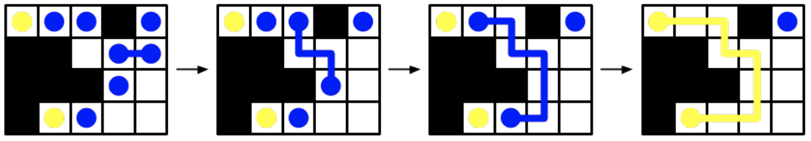

## 문제

What a time to be alive! Today, the very first cold fusion reactor has just been built and cleared for operation. Of course, when the reactor is started for the first time, nothing happens.

Bewildered physicists pore over their calculations looking for errors. Countless double-checks and triple-checks are made before a trio of engineers discover the problem: two atoms in the reactor have become α-stuck!

The reactor can be thought of as a grid of cells with R rows and C columns. Each cell is either empty, contains a deuterium atom (two of which are α-stuck) or is blocked off by a control rod to prevent runaway reactions. Each cell is adjacent to the four cells to its left, right, top and bottom (cells on the edge of the reactor are adjacent to fewer than four cells).

You can issue fusion instructions to the reactor by specifying two atoms to be fused. Be wary; two atoms can be fused only if they are in adjacent cells or there is a path of adjacent empty cells from one atom to the other. When two atoms are fused, they will produce helium which floats away, effectively removing the two original atoms from the reactor (leaving the cells empty).

In order to fix the problem in the reactor, you will need to fuse the α-stuck atoms with each other. What is the fewest number of instructions you need to give to the reactor in order to fuse the α-stuck atoms?

Figure F.1: This is the reactor for Sample Input 1. Black squares denote blocked off cells, blue circles denote deuterium atoms and the yellow circles denote the two α-stuck atoms. One optimal sequence of fusions is shown.

Will you and your fellow engineers overcome the final barrier to cold fusion?

## 입력

The first line of input contains two integers R (1 ≤ R ≤ 1000), which is the number of rows in the reactor, and C (1 ≤ C ≤ 1000), which is the number of columns in the reactor. The next R lines describe the reactor. Each of these lines is a string with exactly C characters.

* ‘.’ denotes an empty cell.
* ‘#’ denotes a blocked cell.
* ‘O’ denotes a cell containing a deuterium atom.
* ‘A’ denotes a cell containing an α-stuck atom.

There are exactly two ‘A’s in the input.

## 출력

Display the minimum number of fusion instructions needed to fuse the α-stuck atoms. If it is not possible to fuse the α-stuck atoms together, display -1 instead.
