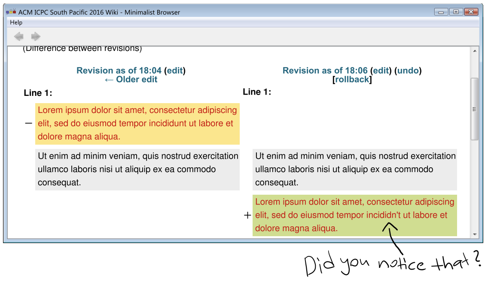

## 문제

Nowadays, web applications let us compare revision history for posts and articles using some variant of the quintessential `diff` utility that finds a small set of insertions and deletions to transform one document into another.

Here is a typical problem with it. Suppose the original document is made up of two paragraphs, `P1` `P2`, and we edit it to become `P2` `P1`. Then `diff` might describe the changes as: delete `P1`, leave `P2`, insert some new text. The fact that the new text is equal to `P1` is not used. So, in some sense, `diff` is “linear” and does not work in the most convenient way possible when we re-order parts of the document.

Can we do better? (More importantly, can it be finished today?) We will adopt this basic requirement: when a part of the new version of a document has appeared somewhere in the old version, it should be highlighted to reflect this fact.

To capture this idea, define the Intuidiff distance from one document to another as the smallest integer N, such that the second document is the concatenation of N blocks, where each block is either a substring of the original document or a single new character. (Note that we do not need to worry about deletions because, unlike `diff`, we do not implicitly begin with the original document—instead, it starts off empty. Thus, the Intuidiff distance from a document to itself is 1. But this is the only counter-intuitive thing about it.)

Given two strings, compute and print the Intuidiff distance from the first to the second.

## 입력

The input consists of two lines. Each line contains a string whose length is between 1 and 500 000 inclusive. Each string only contains alphanumeric and underscore characters.

## 출력

Display the Intuidiff distance from the first string in the input to the second string in the input.

## 힌트

An optimal Intuidiff concatenation for Sample Input 1 is:

`p + aragraph_ + e + d + i + t + 3 + _ + Paragraph`
