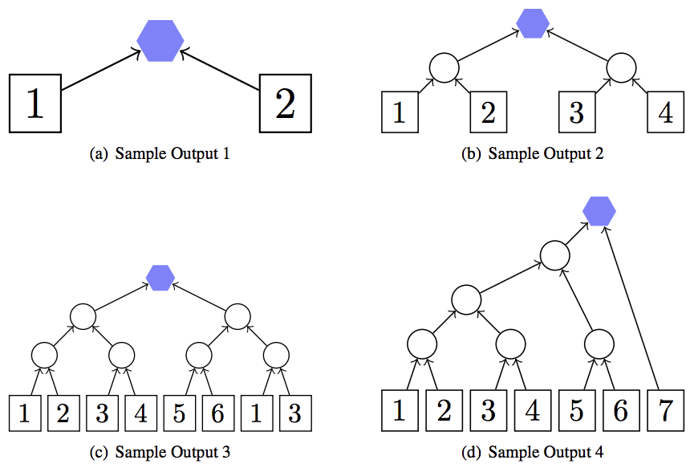

## 문제

Jousting is a sport that consists of two knights on horseback attempting to knock the opponent off their horse. Jousting tournaments are becoming more and more popular. Back in the old days, there were only a few jousters, so coming up with a schedule for the tournaments was easy. But now that there are so many participants, a more automated system is required. This is where you come in: you must give a schedule that will determine who is the best in the entire tournament.

There are n competitors in the tournament numbered 1, 2, . . . , n. Each jouster will have their own skill level that will remain constant throughout the entire tournament. The winner of each match is the jouster with the higher skill level. For simplicity, we will assume that each jouster has a different skill level, so there are no ties.

The schedule must be given as an ordered sequence of triples. The first two components of each triple should contain the two competitors and the last component of the triple is the winner. The winner must be a placeholder (represented by a lowercase letter) and the competitors can be either a number or a placeholder. For example, consider the following match:

```

1 2 a
```

This means that jouster 1 competes against jouster 2 and then a will be the number of the winner of that match. From that point onwards, a can be used as a competitor. For example, consider the following schedule for a tournament with 4 jousters and 3 matches:

```

1 2 a
3 4 b
a b c
```

The winner of the tournament above is the jouster that is represented by c. A placeholder may only be used as a competitor once it has been used as a winner in a previous match. A placeholder cannot be used as both a competitor and the winner in the same match. You may reuse placeholders, but once you set a placeholder to the winner of some joust, that placeholder loses the information from previous matches with that same placeholder as the winner.

Note that a jouster may compete in any number of matches. The figure below gives an illustration for the tournaments given in the sample outputs.

## 입력

The input consists of a single line containing one integer n (2 ≤ n ≤ 1 000), which is the number of competitors in the tournament.

## 출력

Display any valid schedule that will determine the winner of the n jouster tournament. The tournament must consist of no more than 10 000 matches. Each match must be represented as 3 space separated items on one line. The only items that can appear are integers 1, 2, . . . , n and lowercase letters a, . . . , z. At the end of the tournament, the winner must be stored in the placeholder a. This means that the example above with 4 jousters and 3 matches is not a valid answer since the winner was stored in the placeholder c.

It is fine if both competitors in some match are the same. For example, in Sample Output 3, if competitor 1 is the tournament winner, then the final match will be competitor 1 against competitor 1. Any valid schedule will be considered correct.

## 힌트



Figure J.1: Sample Outputs
