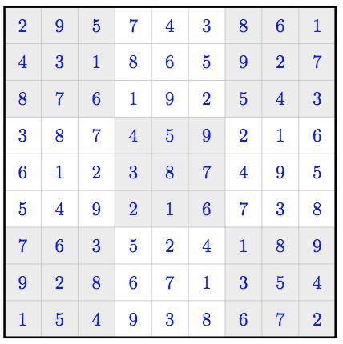
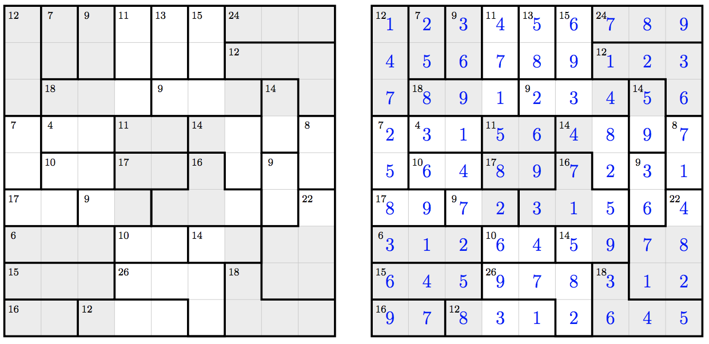

## 문제

Standard Sudoku puzzles have been popular for long enough now that you are probably very familiar with them. However, just in case you have missed them, we will start with a quick recap.

A Sudoku puzzle is a 9 × 9 grid of squares that must be filled in with the numbers 1 to 9, one number per square, such that each of the nine rows, nine columns and nine major sub-grids contain a permutation of the numbers 1 to 9. (The major sub-grids are the nine 3×3 sub-grids that make up the overall 9 × 9 grid.) A standard Sudoku puzzle starts with some numbers already placed in their squares and the aim is to fill in the rest of the puzzle so as to meet the row, column and major sub-grid constraints. Figure K.1 is an example of a solved standard Sudoku.

Killer Sudoku is a popular variant on the standard form, such that instead of starting with some individual numbers already placed in their squares, the grid is divided into one or more connected regions popularly known as cages and there are constraints on the numbers that may appear in the cages. Each cage has a total specifying what the number(s) in the cage must sum to. In the sub-variant that we consider here, the number(s) in a cage must also be a set (that is, there must be no repeated numbers in a cage).



Figure K.1: A standard Sudoku.



Figure K.2: A Killer Sudoku grid (left) with a solution (right).

Your task is to check whether a completed grid meets all Killer Sudoku constraints for the sub-variant we consider: the row, column, major sub-grid and cage constraints. Note that there is no guarantee that the cages in a grid are such that the grid is soluble as a Killer Sudoku puzzle.

## 입력

The input starts with a diagram of the grid. The diagram is a 19 × 37 array of characters.

The grid is a 9 × 9 grid of (not quite square) “squares”, as would be expected. A square, including its border, consists of 3 (vertically aligned) rows of 5 characters each. The border of each square is shared with the relevant adjacent squares, where they exist, and the border is filled in around the grid’s edge, as though the exterior were boundaries of an extra cage. The interior of each square consists of a row of 3 characters: a space, the integer N (1 ≤ N ≤ 9) in the square and another space.

The 4 border corners of a square are each defined by a plus (+) character. Each border side between vertically adjacent squares is defined by 3 characters between the corresponding corners. These 3 characters are all spaces if the two squares sharing the border are in the same cage and otherwise they are all hyphens (-). Each border side between horizontally adjacent squares is defined by a single character (under one corner and above another). This character is a space if the squares sharing the border are in the same cage and is a vertical bar (|) otherwise.

```

+---+---+---+---+---+---+---+---+---+      +---+---+---+---+---+---+---+---+---+
| 0   0   0   0   0   0   0   0   0 |      | 0 | 0 | 0 | 0 | 0 | 0 | 0 | 0 | 0 |
+   +   +   +   +   +   +   +   +   +      +---+---+---+---+---+---+---+---+---+
| 0   0   0   0   0   0   0   0   0 |      | 0 | 0 | 0 | 0 | 0 | 0 | 0 | 0 | 0 |
+   +   +   +   +   +   +   +   +   +      +---+---+---+---+---+---+---+---+---+
| 0   0   0   0   0   0   0   0   0 |      | 0 | 0 | 0 | 0 | 0 | 0 | 0 | 0 | 0 |
+   +   +   +   +   +   +   +   +   +      +---+---+---+---+---+---+---+---+---+
| 0   0   0   0   0   0   0   0   0 |      | 0 | 0 | 0 | 0 | 0 | 0 | 0 | 0 | 0 |
+   +   +   +   +   +   +   +   +   +      +---+---+---+---+---+---+---+---+---+
| 0   0   0   0   0   0   0   0   0 |      | 0 | 0 | 0 | 0 | 0 | 0 | 0 | 0 | 0 |
+   +   +   +   +   +   +   +   +   +      +---+---+---+---+---+---+---+---+---+
| 0   0   0   0   0   0   0   0   0 |      | 0 | 0 | 0 | 0 | 0 | 0 | 0 | 0 | 0 |
+   +   +   +   +   +   +   +   +   +      +---+---+---+---+---+---+---+---+---+
| 0   0   0   0   0   0   0   0   0 |      | 0 | 0 | 0 | 0 | 0 | 0 | 0 | 0 | 0 |
+   +   +   +   +   +   +   +   +   +      +---+---+---+---+---+---+---+---+---+
| 0   0   0   0   0   0   0   0   0 |      | 0 | 0 | 0 | 0 | 0 | 0 | 0 | 0 | 0 |
+   +   +   +   +   +   +   +   +   +      +---+---+---+---+---+---+---+---+---+
| 0   0   0   0   0   0   0   0   0 |      | 0 | 0 | 0 | 0 | 0 | 0 | 0 | 0 | 0 |
+---+---+---+---+---+---+---+---+---+      +---+---+---+---+---+---+---+---+---+
```

Figure K.3: The general structure for the grid is given here. Each 0 will be an integer from 1 to 9. The left is the minimal case with one large cage and the right is the maximal case with 81 small cages.

This is followed by one line for each cage in the diagram. Each line contains three integers R (1 ≤ R ≤ 9), C (1 ≤ C ≤ 9) and S (1 ≤ S ≤ 45). R and C specify the row and column of a square within this cage and S specifies the value that the number(s) within this cage must sum to.

The rows are numbered from 1 at the top to 9 at the bottom. The columns are numbered from 1 at the left to 9 at the right. The input contains exactly one constraint per cage.

## 출력

Display OK if all of the constraints are met. Otherwise, display NotOK (note that there is no whitespace between Not and OK).

## 힌트

* Sample Input 1 is Figure K.2.
* Sample Input 2 is Figure K.1 with the centre entry changed to a 4. The cages correspond to the normal Sudoku constraints.
