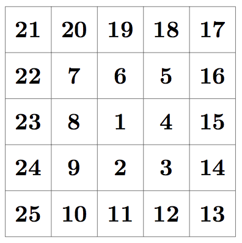
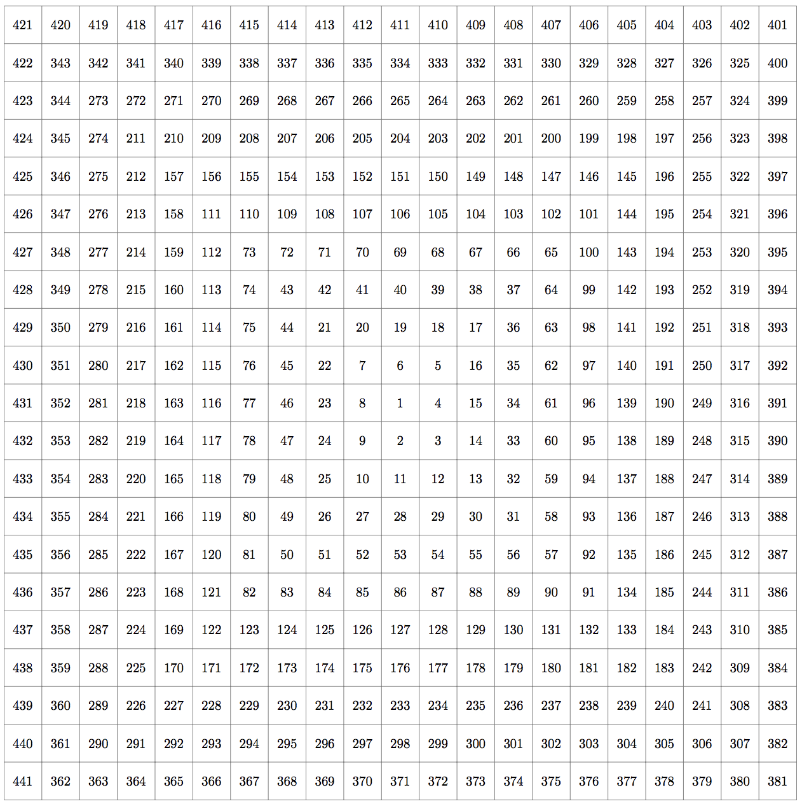

## 문제

You have come up with an idea for a board game. The game is played on a board that is made up of 32 001 × 32 001 numbered squares. The centre square contains the number 1 and the other numbers are arranged in an anticlockwise spiral outwards (first moving downwards, then to the right, then upwards, then to the left, then downwards again, and so on). Figure A.1 displays the 5 × 5 squares in the middle of the board and Figure A.2 displays the 21 × 21 squares in the middle of the board for further clarification. When playing the game, players will only be able to move up, left, down and right. To help work out the rules for the game, you would like to know the shortest distance between two squares on the board using only these moves.

Figure A.1: The middle 25 squares.

## 입력

The input consists of a single line containing two integers a (1 ≤ a ≤ 109), which is the starting square, and b (1 ≤ b ≤ 109), which is the ending square.

## 출력

Display the shortest distance between a and b.

## 힌트

Figure A.2: The middle 441 squares.
