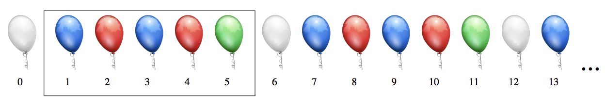

## 문제

Figure B.1: An infinitely long line of balloons

Darcy has taken over management of a balloon warehouse. Unfortunately, it stocks an infinite supply of balloons, so he has requested your help! At the start of today, the warehouse consists of an infinitely long line of white balloons. In this problem, we describe a coloured balloon by an integer whose value uniquely represents a particular colour, so initially (taking 0 to mean a white balloon) the contents of the line is given by

0 0 0 . . .

Specific balloons are identified by their 0-indexed position in the line starting from the front of the line (0, 1, 2, . . . ).

Throughout the day, Darcy receives n deliveries of balloons from his supplier. The ith delivery consists of an infinite number of balloons of colour y and comes with the instruction (x, y). If there are any balloons of colour x in the line, then he should insert exactly one balloon of colour y into his infinitely long line immediately after each balloon of colour x already present in the line. Otherwise, he will send the balloons of colour y back.

After all the deliveries of the day are completed, Darcy receives one final instruction from his supplier to check if he has properly followed the instructions he was given: what colour are all the balloons in the positions between l (inclusive) and r (exclusive) in the line? You should help Darcy answer this question.

Consider an example day with four deliveries (0, 1),(1, 3),(0, 1),(1, 2) (for example, it may be that 1 means a blue balloon, 2 means a red balloon and 3 means a green balloon; 0 is white as above). At the end of the day, Darcy’s line resembles the line of balloons in Figure B.1; we describe it by

0 1 2 1 2 3 0 1 . . .

If he is asked for ℓ = 1 and r = 6, he should report the numbers 1 2 1 2 3 corresponding to blue, red, blue, red and green balloons in those positions in order.

## 입력

The first line of the input contains three integers n (1 ≤ n ≤ 200 000), which is the number of deliveries, ℓ and r (0 ≤ ℓ < r ≤ 106 and r − ℓ ≤ 100 000), which are the positions between which to report the balloons’ colours at the end of the day.

The next n lines describe the deliveries. Each of these lines contain two distinct integers x (0 ≤ x < 200 000) and y (0 ≤ y < 200 000), which is the instruction for this delivery

## 출력

Display the colours of the balloons between positions ℓ (inclusive) and r (exclusive).
