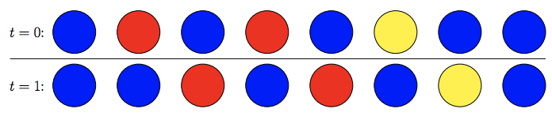
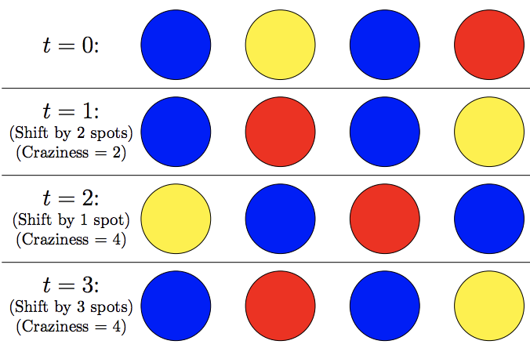

## 문제

Cynthia has a long line of n coloured lights. These lights will be animated by rotating the colours of the lights. To rotate the colours by k spots, the colour of light i at time t is the same as the colour of light (i − k) mod n at time t − 1. When Cynthia does this, there may be several lights that change colour. The craziness of a rotation by k spots is the number of lights that change colour. For example, in Figure C.1, rotating the colours by one spot changes the colour of six lights, so the craziness of this rotation is 6.

Figure C.1: Rotation by one spot.

Cynthia wishes to create an insane sequence, which is a sequence of n − 1 different rotations so that the craziness never decreases. To be specific, an insane sequence is a permutation (p1, p2, . . . , pn−1) of the first n − 1 positive integers such that the craziness of a rotation by pi−1 spots is not more than the craziness of a rotation by pi spots for all i (2 ≤ i < n). Figure C.2 is an example of an insane sequence.

Figure C.2: An insane sequence of rotations (with the permutation 2, 1, 3).

In Figure C.2, a shift of 1 is in the second location (t = 2) of the insane sequence. Given the initial colours of the lights and an integer p, what is the smallest positive integer that can be in the pth location (t = p) of an insane sequence?

## 입력

The first line of input contains two integers n (2 ≤ n ≤ 500 000), which is the number of lights, and p (1 ≤ p < n), which is the location in the sequence that we are interested in.

The second line contains a string of length n, which is the initial configuration of the lights. Each light’s colour is identified by a single character (R for red, B for blue or Y for yellow).

## 출력

Display the smallest number that could be in the pth location of an insane sequence.
