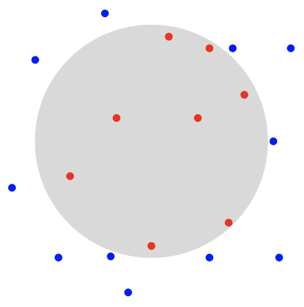

## 문제

Mountain pine beetles (Dendroctonus ponderosae) are small pests that bore into trees and cause a huge amount of damage. Recently, a large increase in their population has occurred and scientists would like some more information about the origin of the outbreak(s). In particular, they want to know if there was a single outbreak or multiple outbreaks. If there is more than one outbreak, then they must raise the alert level.

For each outbreak, the beetles start at a single location (known as the initial infection point) and slowly work their way outwards. If a tree is inside the infection area, then it is infected. If a tree is outside of the infection area, then it is not infected. If a tree is on the boundary of the infection area, then it may or may not be infected. The infection area is always a circle centred at the initial infection point.

Given the locations of the infected and non-infected trees, the scientists need you to determine if there is enough evidence to raise the alert level.

## 입력

The first line of the input contains a single integer n (1 ≤ n ≤ 100), which is the number of trees.

The next n lines describe the trees. Each of these lines contains two integers x (−250 ≤ x ≤ 250) and y (−250 ≤ y ≤ 250), which is the location of the tree, as well as a single character p (I or N), denoting if the tree is infected or not. If p is I, then the tree is infected. If p is N, then the tree is not infected. Trees are single points on the plane. Note that the initial infection point for an outbreak does not need to be a tree and does not have to be at an integer location. The n trees are at distinct locations.

## 출력

If it is guaranteed that there is more than one outbreak, display Yes. Otherwise, display No.
