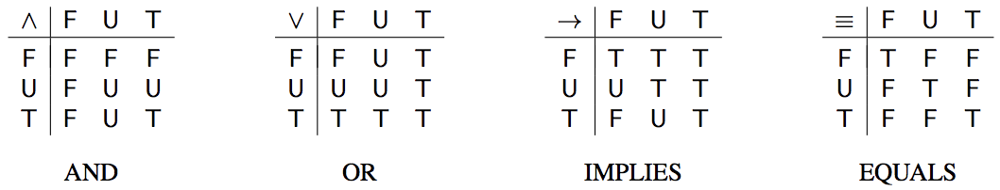

## 문제

Artificial Intelligence is taking over the world, or at least planning to do so soon. Machines will become so clever they can win all games, answer all your questions and make all decisions for you. Because this sounds quite scary, it has been proposed to give the machines a bit of human touch. This feature will make them pretend to not always know the answer to a question, but to express uncertainty from time to time.

Of course, secretly, the machines will still follow precise rules – those of threevalued logic invented by Jan Łukasiewicz. It adds to the two values F (false) and T (true) of Boolean logic a third value U (uncertain) and extends the logic operators as shown in the first three of the following tables:

For example, F ∨ T = T as in Boolean logic, T ∧ U = U and F → U = T. Some functions cannot be expressed using the three operators AND, OR and IMPLIES. For example, f(x, y) = x → x is the constant T function, but there is no expression g(x, y) in terms of x, y, AND, OR and IMPLIES which is constant F.

Let us add the operator EQUALS shown in the right-most of the above tables. It captures equality of its two arguments by returning T if they are the same and F otherwise. Your task is to determine whether a given function g(x, y) can be expressed in terms of x, y, AND, OR, IMPLIES and EQUALS. This is important so the machines know their own limits.

## 입력

The first line of the input contains an integer n (1 ≤ n ≤ 20 000), which is the number of functions you have to consider. This is followed by n function descriptions.

Each function description consists of four lines. The first of these lines is empty. The remaining three lines describe a function g as a table of its values g(x, y). The table has three rows and three columns, corresponding to the values F, U, T of x and y, respectively. Its layout is like that of the tables shown above.

## 출력

For each function description in the same order as in the input, display one line containing either definable or undefinable. Display definable if the given function g(x, y) can be expressed in terms of x, y, AND, OR, IMPLIES and EQUALS. Display undefinable if g(x, y) cannot be expressed this way.
