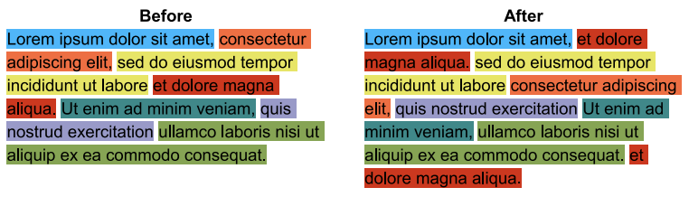
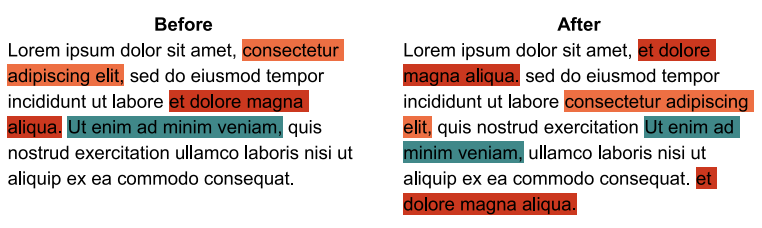

## 문제

You may recall Intuidiff, the alternative to diff that we asked you to help develop at the Divisionals contest. Intuidiff gives an intuitive way to track changes in two files: the original document and the modified document.

We are now onto the next stage of development of Intuidiff. After some preprocessing, the original document has been broken up into several non-overlapping substrings, and each of these has been assigned a different colour (for example, see the ‘Before’ paragraph in Figure I.1). Then, in the modified document, the substrings are coloured using the same colours as those in the original document (for example, see the ‘After’ paragraph in Figure I.1). This allows us to see how large substrings have moved in the document. Substrings with the same colour may appear multiple times in the ‘After’ section, but only once in the ‘Before’ section. For example, the substring “et dolore magna aliqua.” appears twice in the modified document of Figure I.1.

Figure I.1: A full colouring from the Intuidiff program.

While pretty, this full colouring might be overwhelming for some users. Also, it is distracting if every character is highlighted in the modified document. Attention should be focused only on the changes.

Therefore, for the next stage of development of Intuidiff, we must select which substrings to highlight. A full colouring of the document has already been decided on. We must select substrings from the full colouring in such a way that the non-highlighted characters are in the same order as in the original document.

The characters that are not highlighted must be in the same order as in the original document. The selection of substrings is done in such a way that the number of non-highlighted characters in the modified document is maximised (for example, see Figure I.2).

Figure I.2: A desired colouring from the Intuidiff program.

## 입력

The first line of input contains a single integer n (1 ≤ n ≤ 100 000), which is the number of coloured substrings in the full colouring in the modified document. The next n lines describe the coloured substrings in the modified document. Each of these lines contain two integers a and b (0 ≤ a ≤ b ≤ 109), which is the substring of the original document running from the character at index a to the character at index b, inclusive.

No two substrings will partially overlap. That is, if two substrings share any common indices, then the substrings will be identical.

## 출력

Display the number of characters that are not highlighted by Intuidiff in the modified document.

## 힌트

Sample Input 1 is the ‘After’ paragraph from Figure I.1. The 154 non-highlighted characters are shown in Figure I.2.
