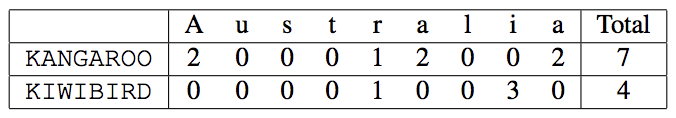

## 문제

As everyone in this room knows, there is an ongoing feud between the national animals of Australia and New Zealand: the kangaroos and the kiwis! Centuries ago, kangaroos and kiwis were great friends and played happily with one another all day and all night. Over time, they both became too tired to play 24 hours per day, so they had to decide what time of day they should play: the day time (preferred by the kangaroos) or the night time (preferred by the kiwis). This disagreement started the feud that has lasted ever since.

The king of the kangaroos and the queen of the kiwis are now at a secret meeting under the Tasman Sea in hopes of stopping this feud. After hours of negotiations, they decide that the only fair way to settle the feud is to get a neutral third party to decide. And that third party is you!

You have come up with the following algorithm to determine the winner:

1. The kangaroo king and kiwi queen must agree upon a secret phrase.
2. Each animal is given a key: KANGAROO for the kangaroos and KIWIBIRD for the kiwis.
3. For each letter in the secret phrase, count the number of times that letter appears in the animal’s key. Uppercase and lowercase should be treated as the same.
4. The total score for each animal is the sum of these counts.
5. The animal with the higher total score is the winner.

For example, if the secret phrase is “Australia”, then the kangaroos’ score would be 7 and the kiwis’ score would be 4. In this case, the kangaroos would win the feud.

Given the secret phrase, who wins the feud?

## 입력

The input will consist of text on one line, the secret phrase. The secret phrase will be non-empty and contain only uppercase letters and lowercase letters. The secret phrase will contain at most 100 characters.

## 출력

If there is a winner of the feud, display the winner’s name: either Kangaroos or Kiwis. If there is a tie, display Feud continues instead.
