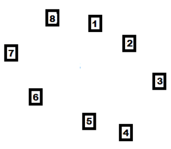

## 문제

Hilary is a fitness enthusiast. Near her home is a reserve which has 8 fitness stations set out in a roughly circular pattern, as shown. Every day, Hilary visits at least 5 of these stations as part of her daily exercise routine.

Hilary s daughter Catherine has been given the task of planning her mother s visits to the fitness stations. Catherine has produced a lot of daily plans, but would like them checked to see that they meet Hilary s requirements. This is your task! Do the plans visit at least 5 stations without repeats?

## 입력

Input consists of data for a single plan. The plan starts with a single one-digit number, S, which is the starting station (0 < S < 9). This is followed by a series of steps, each step being a letter followed by a positive one-digit number less than 8. The step tells Hilary which station to visit next. The letter for the step will be A (for anticlockwise) or C (for clockwise). The number will be how many stations to move. The last step will be #, which indicates there is no more data. Do not process this step.

## 출력

List all stations visited by the plan in the order they are visited, with a space between each station. If the plan does not visit at least 5 different stations, or if it visits a station more than once, the list should be followed by the word “reject”.
