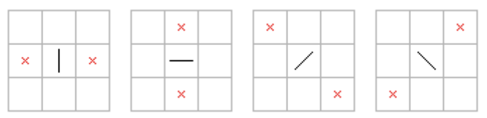
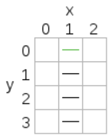
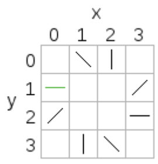
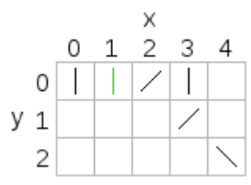

## 문제

One of my favourite childhood games is dominoes – not the original game where tiles are placed flat on a table with numbers matching up (which is also fun), but the game where the tiles are placed upright in a chain, then the first tile is pushed and all of them topple.

Sometimes the dominoes are not positioned well and not all of them will topple. Given the layout of the dominoes, can you work out how many will topple when a particular domino is pushed?

The dominoes are placed on a board at integer coordinates. They have four possible orientations, as shown in the following diagrams (viewed from above):

The black lines are the tops of the dominoes, and the crosses show where they would fall if pushed. The dimensions of the dominoes are such that when they topple they will only push the domino at the marked location (if there is one there).

If a domino hits a second domino that is at an angle of 90 degrees to the first, the second domino will not be toppled (but the first is still counted as toppled).

The positions on the board will be described using x and y coordinates, with the x-axis going from left to right and the y-axis going from top to bottom in the diagrams.

The name of this problem comes from the translation by a popular translation tool of “ドミノ倒し”, the name of this game in Japanese.

## 입력

Input will consist of a sequence of problems. The first line for each problem will have four space-separated integers: N, the number of dominoes (1 ≤ N ≤ 100,000); S, the 0-based index of the first domino pushed (0 ≤ S < N); then Fx and Fy, the direction of the push as a vector (Fx and Fy will be -1, 0, or 1). The following N lines will describe the dominoes. Each line will have two integers and a symbol separated by spaces. The two integers are the x and y coordinates of the domino (0 ≤ x, y, ≤ 100,000), and the symbol is one of |, -, /, or \, giving the orientation of the domino when viewed from above.

The vector (Fx, Fy) will be one of the two directions that domino S can be pushed; for example, if the orientation of domino S when viewed from above is |, then (Fx, Fy) will be either (1, 0) or (-1, 0).

End of input will be denoted by four zeroes and should not be processed.

## 출력

For each problem, output a single integer with the maximum number of dominoes that can be toppled by pushing the first domino in the input.

## 힌트

Problem 1: The domino pushed is the top one. It is pushed in the direction (0, 1) which is down in the diagram, so it will topple the next domino which will topple the next one and so on. All four dominoes will be toppled.

Problem 2: The domino at (0, 1) is pushed in the direction (0, 1) which down in the diagram. It will topple the domino at (0, 2), which will topple the domino at (1, 3), and so on until all the dominoes topple. When the domino at (1, 0) topples, nothing further will happen because the domino at (0, 1) has already toppled.

Problem 3: When the domino at (1, 0) is pushed to the right, it will only topple the dominoes at (2, 0) and (3, 1). The domino at (4, 2) will be pushed by the domino at (3, 1) but won't topple because it is at a 90 degree angle.
