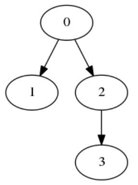
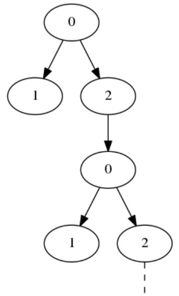

## 문제

Type checking is the process of verifying that a computer program satisfies the typing rules of a programming language. In some languages this is very difficult, and just checking if two types are equal can be tricky!

For this problem, a type will be represented as a tree made up of nodes. Each node has zero or more child nodes, corresponding to component types. Here is an example of a tree:

Figure 1: A simple finite tree. The root is node 0 and its children are nodes 1 and 2. Node 1 does not have any children, and node 2 has one child (node 3).

Types are allowed to be recursive. This means that a node can have any node as a child, including its parent and even itself. The result is an infinite tree:

Figure 2: An infinite tree. Node 0 has node 2 as a child, which has node 0 as a child, which has node 2 as a child, and so on. The tree keeps going forever, and has been truncated to fit on this page.

Given two possibly infinite trees, your task is to determine whether or not they have the same structure. Two nodes A and B have the same structure if

* They have the same number of children, and
* The i'th child of node A has the same structure as the i'th child of node B, for each child index i.

Two trees have the same structure if their root nodes have the same structure.

## 입력

Input will consist of a sequence of problems. The first line for each problem will have two space-separated integers, N and M, the number of nodes in the two trees (1 ≤ N, M ≤ 100,000).

The following N lines will describe the first tree. The i'th of these lines (counting from 0) will consist of a number of space-separated integers describing node i. The first integer will be c[i], the number of children that node i has (0 ≤ c[i]; sum of c[i]'s ≤ 100,000). The rest of the line will contain c[i] space-separated integers, the children of node i. The following M lines will describe the second tree similarly. The root of each tree is always node 0.

Each problem will be followed by a blank line. End of input will be denoted by a line with two zeroes (which should not be processed).

## 출력

For each problem, output "YES" if the two trees have the same structure, or "NO" if they don't.

## 힌트

For the first problem, Figure 1 shows the first tree and the other tree is its mirror image. They have different structures, because the order of the children is significant.

Figure 2 shows the first tree in the second problem. The other tree is represented using more nodes but has the same structure.
