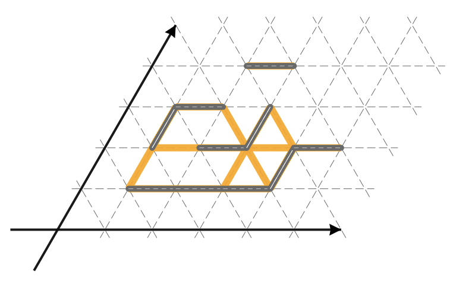

## 문제

U jednom nakrivljenom gradu, staze i ulice se ne grade tako da se sijeku pod pravim kutom, već uvijek pod kutom koji je višekratnik od 60 stupnjeva. Točnije, grad možemo smjestiti u trokutastu mrežu odnosno koordinatni sustav u kojemu x i y osi zatvaraju kut od 60 stupnjeva kao na slici dolje. Ako su A i B točke sa cjelobrojnim koordinatama onda su one susjedi ako je njihova Euklidska udaljenost jednaka 1. Primijetite da sva točka ima točno 6 susjeda.

U gradu postoji n staza — svaka staza povezuje neku točku i jednog njenog susjeda. Grad je osigurao sredstva da se staze asfaltiraju i pretvore u moderne prometnice. Medutim, nije dozvoljeno da na tim, novim prometnicama postoje oštri zavoji. Točnije, nije dozvoljeno da se dvije asfaltirane staze dodiruju u točki i pritom zatvaraju šiljasti kut.

Odredite koliko je najviše staza moguće asfaltirati tako da se ne dobije niti jedan oštar zavoj.

## 입력

U prvom redu se nalazi prirodni broj n (1 ≤ n ≤ 1 000) — broj staza. U svakom od sljedećih n redova nalaze se četiri prirodna broja xA, yA, xB i yB (1 ≤ xA, yA, xB, yB ≤ 100) — redom koordinate točaka A i B koje su povezane stazom. Toˇcke A i B su uvijek susjedne točke, a niti jedna staza se u ulazu ne pojavljuje više puta.

## 출력

Ispišite traženi maksimalni broj asfaltiranih staza.

## 힌트

