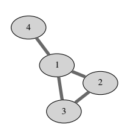
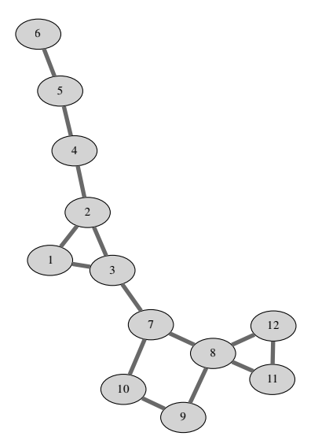

## 문제

Kaktus graf je povezani neusmjereni graf u kojem svaka dva jednostavna ciklusa imaju najviše jedan zajednički vrh. Podsjetimo se, jednostavan ciklus je ciklus u kojemu se vrhovi ne ponavljaju, a u kaktus grafu se niti jedna dva takva ciklusa ne smiju podudarati na više od jednom vrhu grafa.

Na zadanom kaktus grafu igramo igru tako da u svakom koraku odaberemo jedan brid te ga obrišemo. Brid biramo uniformno slučajno medu svim preostalim bridovima (dakle svaki preostali brid brišemo sa jednakom vjerojatnošću), a svi slučajni izbori su nezavisni. Igra završava kada graf više nije povezan — postoje dva vrha izmedu kojih ne postoji niti jedan put.

Odredite očekivani broj koraka da igra završi.

## 입력

U prvom redu se nalaze prirodni brojevi n i m (1 ≤ n ≤ 600, 1 ≤ m ≤ n(n − 1)/2) — broj vrhova i broj bridova grafa. Vrhovi grafa su označeni prirodnim brojevima od 1 do n. U svakom od sljedećih m redova nalaze se dva različita prirodna broja a i b (1 ≤ a, b ≤ n) koji označavaju brid izmedu vrhova a i b. Svaka dva vrha će biti povezana najviše jednom bridom, a graf je kaktus graf kako je opisano u tekstu zadatka.

## 출력

Ispišite traženi očekivani broj koraka. Tolerirat će se apsolutno i relativno odstupanje od službenog rješenja za 10−6.

## 힌트

Sample 1: 

Sample 2: 
