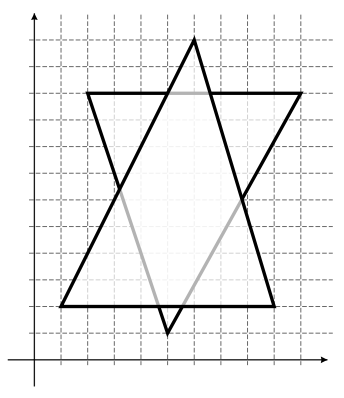
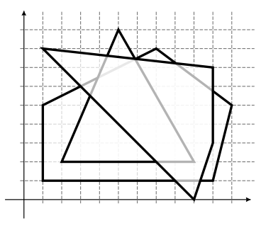

## 문제

Adrian vodenim bojicama crta konveksne poligone u koordinatnom sustavu. U nedostatku vremena neće im popunjavati unutrašnjost, ali želi naglasiti redoslijed kojim su poredani tako da nijansa pojedine točke ruba poligona ovisi o broju poligona koji tu točku prekrivaju. Točnije, recimo da Adrian crta poligone p1, p2, . . . , pn, on će pojedini segment poligona pj nacrtati nijansom t ako se taj segment (osim možda njegovih krajnjih točaka) nalazi u unutrašnjosti točno t od kasnijih poligona pj+1, . . . , pn.

Kada Adrian crta neki segment nijansom t on potroši 1/(t+1) jedinica crne boje po jedinici duljine segmenta. Odredite ukupnu količinu boje koju Adrian treba potrošiti kako bi nacrtao sve poligone.

## 입력

U prvom redu se nalazi prirodni broj n (1 ≤ n ≤ 10) — broj poligona. Slijedi n blokova gdje k-ti blok sadrži opis poligona pk. U prvom redu bloka se nalazi prirodni broj m (3 ≤ m ≤ 20) — broj vrhova poligona. U svakom od sljedećih m redova se nalaze dva cijela broja x i y (0 ≤ x, y ≤ 100) — koordinate jednog vrha poligona. Vrhovi poligona su zadani u pozitivnom smjeru (suprotno od kazaljke na satu), a poligon je uvijek konveksan te ne sadrži uzastopne paralelne stranice.

Možete pretpostaviti da se različiti poligoni nikad ne dodiruju duž vrha ili stranice. Točnije ako su A i B dužine odnosno stranice različitih poligona pi i pj onda A i B uopće nemaju zajedničkih točaka ili se sijeku u točno jednoj točki koja leži u unutrašnjosti dužina A i B.

## 출력

Ispišite traženu ukupnu količinu boje. Tolerirat će se apsolutno i relativno odstupanje od službenog rješenja za 10−6.

## 힌트

Sample 1: 

Sample 2: 
