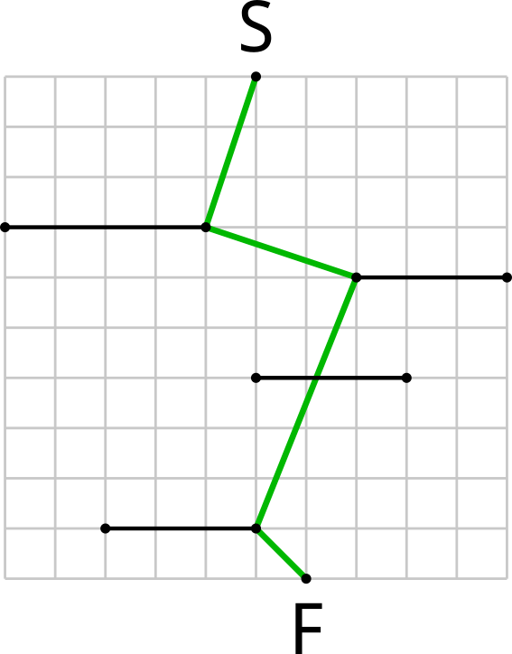

## 문제

After an unsuccessful attempt to qualify for IOI, Kleofáš decided to become a slalom skiing champion. Tomorrow is a very important day in Kleofáš's life: he will compete in his very first skiing contest!

During the contest, Kleofáš will have to get from a starting point to a finishing point, while passing through $n$ gates. In order to be as fast as possible, Kleofáš wants to use the shortest possible trajectory.

A skiing course can be described as a starting point $S$, a finishing point $F$ and $n$ gates. Each gate is a line segment parallel to the $x$ axis (i. e. horizontal). No two gates are at the same $y$ coordinate (altitude). The starting point is above each gate i. e. its $y$ coordinate is higher than $y$ coordinate of any gate. The finishing point is below each gate and below the starting point.

Find the shortest polygonal chain starting at point $S$, finishing at point $F$ and intersecting all gates, in order **from top to bottom**. We say that a polygonal chain intersects a line segment if they have at least one common point (this point **can** be an endpoint of the line segment).

## 입력

First line of the input contains one integer $n$ ($0 \leq n \leq 10^6$) -- number of gates. Second line contains four integers $x\_S, y\_S, x\_F, y\_F$: coordinates of points $S = (x\_S, y\_S)$ and $F = (x\_F, y\_F)$ respectively.

$n$ lines follow, $i$-th of them contains three integers ${x\_1}\_i, {x\_2}\_i, {y}\_i$, meaning that $i$-th gate is a segment from $({x\_1}\_i, y\_i)$ to $({x\_2}\_i, y\_i)$. For each $i$,  ${x\_1}\_i < {x\_2}\_i$ holds.

All coordinates are between $-10^9$ and $10^9$, inclusive. Gates are ordered from top to bottom, i. e. $y\_S > y\_1 > y\_2 > \dots > y\_n > y\_F$

## 출력

It can be proven that there always exists a unique shortest polygonal chain and all its vertices have integer coordinates. Output this chain without any redundant vertices (i. e. only output vertices where the chain changes its direction).

On the first line of the output print a single integer $k$ -- number of vertices in the optimal chain. Then print $k$ more lines, $i$-th of them containing two space-separated integers $x\_i, y\_i$ -- coordinates of the $i$-th vertex of the chain. Vertices must be named from the start of the chain to the end, thus $x\_1 = x\_S, y\_1 = y\_S, x\_k = x\_F, y\_k = y\_F$ and $y\_1 > y\_2 > \dots > y\_k$ must hold.

## 힌트

The situation looks like this:

