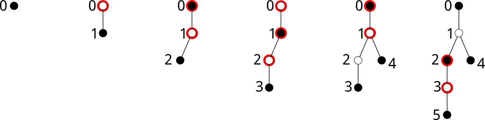

## 문제

*Magic: The Gathering* card game has an interesting game mechanic of casting and countering spells. We are not going to explain it here, as it's quite complex and not necessary to solve this task. However, if you are a MtG player, you may see how this task is related to the spell countering mechanic.

For each rooted tree there is a unique way of coloring its vertices by two colors (black and white) satisfying the following constraint:

* A vertex is white if and only if it has a black son.

Uniqueness of this coloring can be easily proven by induction. We will call a tree *well-colored* if it's colored in this way.

We start with a rooted tree consisting of one black vertex (the root) and do the following operation $n$-times:

* $add(v)$ -- Add a new black vertex to the tree as a son of vertex $v$. Then invert colors of some (possibly zero, possibly all) vertices in the tree so that the resulting tree is well-colored.

For each operation, we want to know how many vertices are inverted during this operation.

## 입력

The root of the tree is numbered $0$, other vertices are numbered $1, 2, \dots, n$ in the order they are added to the tree.

The first line of the input contains a single integer $n$ ($1 \leq n \leq 200000$) -- number of vertex additions.

$n$ lines follow, $i$-th of them containing number $v\_i$ -- ID of father of vertex added in $i$-th operation. It's guaranteed that vertex $v\_i$ already exists before $i$-th operation, that is $v\_i < i$.

## 출력

For each operation output one line containing number of vertices whose colors will be inverted during this operation.

## 힌트

The situation after each operation looks like this (vertices inverted during previous operation are highlighted):

