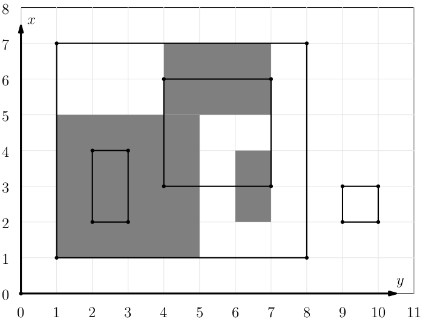

## 문제

Deep in the top-secret base of Keepers of the Sacred Postulates, there's The Wall with many rectangular posters depicting deep knowledge derived from their most valuable postulates. They are quite rare, thus they are placed so that they don't overlap.

Occasionally, a batch of new posters worthy of the honor of being placed on The Wall arrives. The Keepers then have to decide, where to place the new posters. It's a complicated process and you are to help with one of its steps.

The Keepers are currently picking candidate positions for the posters. You are to quickly compute the total area of currently hanging posters that would be shadowed by placing a new poster at a given position.

You are given a description of $n$ disjoint gray rectangles in a plane. You are to answer $q$ queries of the form: What is the total grey area in a given rectangle? Note that this doesn't affect the plane.

The answer has to be produced online

## 입력

The first line contains five numbers, $r, c, n, q, m$, ($1 \leq r, c < m \leq 10^9 + 9$, $0 \leq n,q \leq 50\,000$), the height and width of the wall, number of posters on the wall, number of queries and a modulus for computing the queries (we will explain that below).

Each of the next $n$ lines contains four numbers, $x\_1, y\_1, x\_2, y\_2$ ($0 \leq x\_1, x\_2 \leq r$, $0 \leq y\_1, y\_2 \leq c$), the coordinates of two opposite corners of the rectangle.

The last $q$ lines contain five numbers $x\_1', y\_1', x\_2', y\_2', v$, each between $0$ and $m - 1$ (inclusive). You can compute the real coordinates $x\_1, y\_1, x\_2, y\_2$ using the formula below.

Let's denote by $l$ the answer to the last query (with $l=0$ for the first query). Then $$x\_i = (x\_i' + l \cdot v) \pmod m$$ $$y\_i = (y\_i' + l \cdot v) \pmod m$$

The decoded coordinates $x\_1, y\_1, x\_2, y\_2$ satisfy following conditions: $0 \leq x\_1, x\_2 \leq r$, $0 \leq y\_1, y\_2 \leq c$.

There are several subtasks. In offline subtasks, the value $v$ will be zero for each query.

| subtask | points | maximum $r$ | maximum $c$ | maximum $n$ and $q$ | online |
| --- | --- | --- | --- | --- | --- |
| 1 | 10 | $500$ | $500$ | $500$ | no |
| 2 | 10 | $5000$ | $5000$ | $5000$ | no |
| 3 | 40 | $300\,000$ | $300\,000$ | $50\,000$ | no |
| 4 | 10 | $10^9$ | $200\,000$ | $50\,000$ | no |
| 5 | 10 | $10^9$ | $10^9$ | $50\,000$ | no |
| 6 | 10 | $100\,002$ | $100\,002$ | $50\,000$ | yes |
| 7 | 10 | $10^9 + 8$ | $10^9 + 8$ | $50\,000$ | yes |

## 출력

For each query output one line containing a single number: Answer to the query.

## 힌트

Sample 1: You can view the whole plane below.

Sample 2: This is the same input as above, using online queries.
