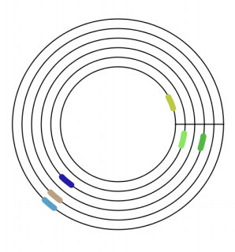

## 문제

There is a racetrack where n players complete laps. Each player has their own maximum speed. In this racetrack, overtaking is only possible near the finish line at every lap: when a player approaches a slower player, she will stay behind him until at the finish line. At the finish line, all players crossing the line at the same time resume driving at their maximum speed (so faster players overtake slower ones). Initially, all players start at the finish line. Given the lap time and the number of laps to complete for each player, calculate the times they complete the race in.

## 입력

The first line contains an integer n (1 ≤ n ≤ 5 000), the number of players. The following n lines contain the players’ lap time and number of laps to complete: the i-th line contains two integers ti and ci (1 ≤ ti ≤ 106, 1 ≤ ci ≤ 1 000), the lap time and the number of laps to complete for player i. The players are sorted in decreasing order of speed, that is, t1 ≤ t2 ≤ . . . ≤ tn.

## 출력

Output n lines; the i’th line must contain the time that player i completes the race.
