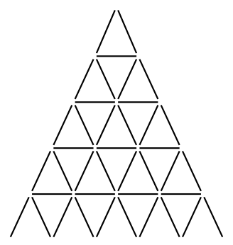

## 문제

Brian and Susan are old friends, and they always dare each other to do reckless things. Recently Brian had the audacity to take the bottom right exit out of their annual maze race, instead of the usual top left one. In order to trump this, Susan needs to think big. She will build a house of cards so big that, should it topple over, the entire country would be buried by cards. It’s going to be huge!

The house will have a triangular shape. The illustration to the right shows a house of height 6, and Figure D.1 shows a schematic figure of a house of height 5.

For aesthetic reasons, the cards used to build the tower should feature each of the four suits (clubs, diamonds, hearts, spades) equally often. Depending on the height of the tower, this may or may not be possible. Given a lower bound h0 on the height of the tower, what is the smallest possible height h ≥ h0 such that it is possible to build the tower?

Figure D.1: A house of height 5 uses 40 cards.

## 입력

A single integer 1 ≤ h0 ≤ 101000, the minimum height of the tower.

## 출력

An integer, the smallest h ≥ h0 such that it is possible to build a tower of height h.
