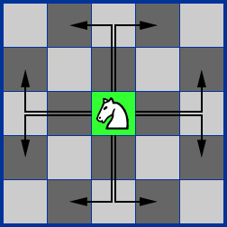
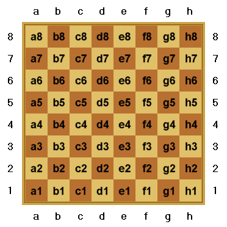

## 문제

In Chess, the knight is the weirdest of all the pieces. To begin with, the piece is actually a horse without any human riding it. The second reason is its movement pattern. It can move 2 cells forward and one to the side. Below you can see all the possible destinations of a knight.

With a movement pattern so weird, it is complicated to know what’s the shortest path between two board squares. Can you write a program that computes the minimum number of movements needed to move a knight from one square to another? Remember that a chessboard has 8 rows and 8 columns. Also in the standard notation, the columns are represented by letters from a to h.

## 입력

The input will contain 2 lines. The first line will be the starting position of the knight and the second line will specify its final position.

## 출력

Output a single integer specifying the minimum number of moves for the knight to get from it’s starting position to it’s final position on the board.
