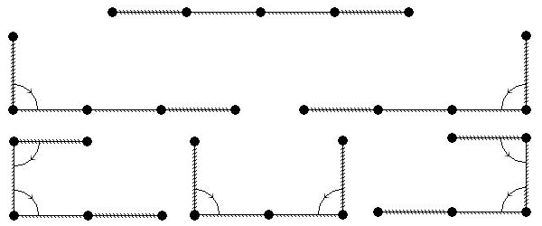

## 문제

Tadhg has found an interesting tape in his school chemistry lab. The tape is divided into N segments of equal length, and can easily be bent between two segments, but only by exactly 180 degrees.

One side of the tape is completely covered with a very volatile chemical. If the chemical comes in contact with itself, it reaches critical mass and explodes.

The other side of the tape is not completely covered yet. Only the first A segments and last B segments are covered, with the exact same chemical.

Write a program that will calculate the number of different ways Tadhg can bend the tape so that it does not explode. He can bend the tape more than once and two ways are different if there is at least one bevel between segments that is not bent in one and is bent in the other.

Since the solution can be huge, print the result modulo 10301.

The following example illustrates all 6 possible ways for N=4, A=1 and B=1. For clarity, the tape is only bent 90 degrees on the illustration. Tadhg would actually bend it 180 degrees.

Note: The unbent stage counts as 1 position

## 입력

The first and only line of input contains three natural numbers N, A and B (A>0, B>0, A+B ≤ N ≤ 1000), total number of segments, number of covered segments from the left and from the right respectively.

## 출력

The first and only line of output should contain the number of possible ways to bend the tape modulo 10301.
