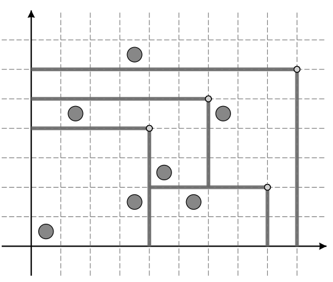

## 문제

A pasture in the wild west can be represented as a rectangular grid embedded in the upper-right quadrant of a standard coordinate system. A herd of n buffalos is scattered throughout the grid, each occupying a unit square. Buffalos are numbered 1 through n; buffalo j is located in the unit square whose upper-right corner is the point with integer coordinates (xj, yj). The coordinate axes represent two rivers meeting at the origin, restricting buffalo movement downwards and leftwards.

A total of m settlers arrive, one by one, and each claims a piece of land using the following procedure:

1. The settler picks a point with integer coordinates and installs a single fence post at that point. The point he picks is guaranteed to be free of any previously installed fence posts or fences. Moreover, no two fence posts will have the same x-coordinate and no two fence posts will have the same y-coordinates.
2. Starting from the fence post, the settler builds horizontal and vertical fence segments leftwards and downwards, respectively. Each segment is built to be as long as possible — i. e. until it reaches the river or another fence.
3. The settler claims all the land in the connected area bounded with fences and rivers whose upper-right corner is his fence post. Of course, he claims all the buffalos inside as well. Note that settlers arriving later may claim pieces of land already claimed by earlier settlers.

For each settler, find the total number of buffalos he claimed when he arrived.

## 입력

The first line contains an integer n (1 ≤ n ≤ 300 000) — the number of buffalos. The j-th of the following n lines contains two integers xj and yj (1 ≤ xj, yj ≤ 109) — the location of the j-th buffalo. No two buffalos will share the same location.

The following line contains an integer m (1 ≤ m ≤ 300 000) — the number of settlers. The j-th of the following m lines contains two integers x'j and y'j (1 ≤ x'j , y'j ≤ 109) — the coordinates of the fence post installed by the j-th settler. All x'j are different and all y'j are different.

## 출력

Output m lines. The j-th line should contain the number of buffalos claimed by the j-th settler upon arrival.

## 힌트

