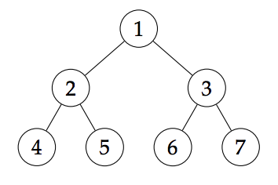

## 문제

As you probably know, a tree is a graph consisting of n nodes and n − 1 undirected edges in which any two nodes are connected by exactly one path. In a labeled tree each node is labeled with a different integer between 1 and n.

The Prüfer code of a labeled tree is a unique sequence associated with the tree, generated by repeatedly removing nodes from the tree until only two nodes remain. More precisely, in each step we remove the leaf with the smallest label and append the label of its neighbour to the end of the code. Recall, a leaf is a node with exactly one neighbour. Therefore, the Prüfer code of a labeled tree is an integer sequence of length n − 2. It can be shown that the original tree can be easily reconstructed from its Prüfer code.

The complete binary tree of depth k, denoted with Ck, is a labeled tree with 2k − 1 nodes where node j is connected to nodes 2j and 2j + 1 for all j < 2k−1. Denote the Prüfer code of Ck with p1, p2, . . . , p2k−3

Since the Prüfer code of Ck can be quite long, you do not have to print it out. Instead, you need to answer n questions about the sums of certain elements on the code. Each question consists of three integers: a, d and m. The answer is the sum of the of the Ck’s Prüfer code elements pa, pa+d , pa+2d , . . . , pa+(m−1)d.

## 입력

The first line contains two integers k and q (2 ≤ k ≤ 30, 1 ≤ q ≤ 300) — the depth of the complete binary tree and the number of questions. The j-th of the following q lines contains the j-th question: three positive integers aj, dj and mj such that aj, dj and aj + (mj − 1)dj are all at most 2k − 3.

## 출력

Output 1 lines. The j-th line should contain a single integer — the answer to the j-th question.

## 힌트

In the first example above, when constructing the Prüfer code for C3 the nodes are removed in the following order: 4, 5, 2, 1, 6. Therefore, the Prüfer code of C3 is 2, 2, 1, 3, 3.
