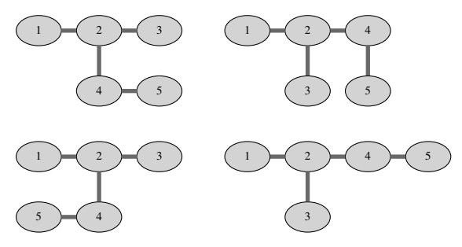

## 문제

As you probably know, a tree is a graph consisting of n nodes and n − 1 undirected edges in which any two nodes are connected by exactly one path. In a labeled tree each node is labeled with a different integer between 1 and n. In general, it may be hard to visualize trees nicely, but some trees can be neatly embedded in rectangular grids.

Given a labeled tree G with n nodes, a 2 by n embedding of G is a mapping of nodes of G to the cells of a rectangular grid consisting of 2 rows and n columns such that:

* Node 1 is mapped to the cell in the upper-left corner.
* Nodes connected with an edge are mapped to neighboring grid cells (up, down, left or right).
* No two nodes are mapped to the same cell.

Find the number of 2 by n embeddings of a given tree, modulo 109 + 7.

## 입력

The first line contains an integer n (1 ≤ n ≤ 300 000) — the number of nodes in G. The j-th of the following n − 1 lines contains two different integers aj and bj (1 ≤ aj, bj ≤ n) — the endpoints of the j-th edge.

## 출력

Output the number of 2 by n embeddings of the given tree, modulo 109 + 7.

## 힌트

All 4 embeddings of the tree in the example input are given in the figure above.
